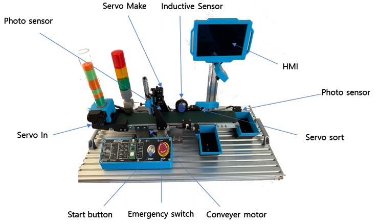
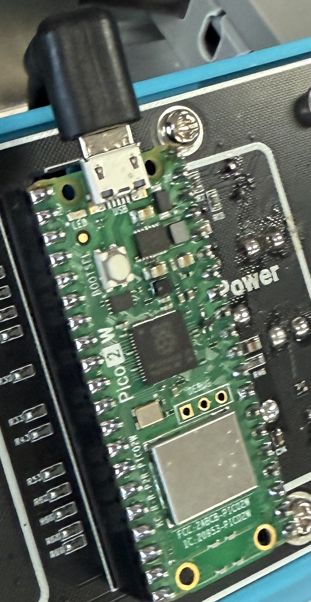

# XConvey Overview
## 스마트 팩토리 
스마트 팩토리는 ICT(Information and Communication Technology)를 기반으로 제조 현장의 데이터를 
실시간으로 수집하고 분석하여, 생산 공정을 자동화하고 최적화하는 지능형 제조 시스템입니다.

사람, 기계, 로봇, 소프트웨어, 네트워크 등이 유기적으로 연결되어 사이버 물리 시스템(CPS)을 구성하며, 
이를 통해 제조 품질 향상, 생산 효율화, 비용 절감 등의 효과를 달성할 수 있습니다.

스마트 팩토리는 IoT(사물인터넷), 빅데이터, 인공지능(AI), 엣지 컴퓨팅, 클라우드 기술, 디지털 트윈, 
5G 등 첨단 기술의 융합으로 구현되며, 다음과 같은 특징을 갖습니다.

- 장비 상태를 실시간으로 모니터링하고 고장을 사전에 예측하여 유지보수 비용 절감
- 생산 이력을 분석하여 품질을 관리하고 맞춤형 제품 생산 가능
- 공정 데이터를 기반으로 자동화 및 자율 운영 가능
- 에너지 절약, 자원 최적화, 탄소 배출 저감 등 지속 가능성 제고

스마트 팩토리는 전통적인 제조업을 디지털 기반의 지능형 산업 구조로 전환시키는 핵심 요소이며, 
산업 4.0의 중심 개념으로 각광받고 있습니다.

## XConvey
XConvey는 스마트 팩토리를 소형화 하여 실습해볼 수 있는 장비입니다. 센서 데이터 및 액추에이터 데이터를 통신을 통해 컴퓨터에서 수집하고 각종 데이터를 화면에 표시합니다. 각 센서간의 데이터의 수집 방법과 분류 방법, 나아가 인공지능을 통한 분류기능을 구현하여, 이를 통해 습득한 지식을 산업현장에서 쉽게 적용할 수 있습니다. 


## XConvey 구성 
XConvey는 인터넷 기반 자동 설비 제어에 필요한 소프트웨어 기술 학습을 위한 플랫폼입니다. HMI와 Auto 제어기, 센서, 액츄에이터, 주변장치로 구성됩니다.  




### HMI (Human Machine Interface)
HMI는 사용자와 기계간의 상호작용을 가능하게 해주는 인터페이스입니다. 자동화 산업에서 기계와 작업자 간의 통신을 원활하게하여 작업 효율을 높이는데 사용됩니다. 사물인터넷 환경에서 데이터를 수집하고 전송하며, 데이터를 시각화하는 용도로도 활용됩니다. 
XConvey의 HMI는 Linux 계열의 OS를 기반으로 다양한 프로그래밍 언어를 처리할 수 있으며, Wi-Fi나 Bluetooth를 통해 무선 통신기능을 포함하고 있습니다. 


XConvey의 HMI는 다음과 같은 특징을 갖습니다.

- ARM Cortex-A76 기반의 고성능 CPU 탑재
- Wi-Fi 및 Bluetooth, BLE 기반의 무선 통신 기능 제공 
- 7-inch TFT-LCD 및 TouchScreen 탑재
- 머신러닝 기반 스마트홈 자동화 확장을 위해 AI 가속기 지원 

### Auto 제어기 
Auto 제어기는 I/O 포트등을 통해 산업 현장의 다양한 장치를 제어할 수 있습니다. I/O 포트를 통해 DC 모터의 속도를 정밀하게 조절할 수 있습니다. 또한, 스위치, 센서, 서보 모터 등을 연결하여 다양한 작업을 수행할 수 있습니다. 



### 기능에 따른 XConvey 구분    
---
XConvey는 기능에 따라 Security Block, Transfer Block, Fedding Block, Processing Block, Sorting Block으로 분류할 수 있습니다. 각각은 Auto 제어기를 통해 제어됩니다. 또한 동작을 눈으로 확인하는 것에 그치지 않고, 피드백 신호를 통해 제어 신호가 정상적으로 동작했는지를 확인도 가능합니다. 

#### Security Block
Security Block은 두 개의 스위치와 다수의 LED로 구성되어 있습니다. Auto 제어기 우측에 두 개의 스위치는 START 와 STOP 으로 START 는 동작 시작, STOP 은 비상 정지 기능을 포함합니다. 

#### Transfer Block 
Transfer Block은 DC모터와 컨베이어 벨트로 구성되며, 컨베이어 벨트는 2개의 롤러와 벨트, 프로파일, 타이밍 풀리로 구성되어 있습니다.

#### Feeding Block 
Feeding Block은 XConvey에서 가공 및 분류용 물품을 적재하고 자동으로 공급하는 역할을 담당합니다. Photo Sensor와 1개의 서보 모터가 장착되어 있습니다.

#### Processing Block 
Processing Block은 가공 블록이며, Photo Sensor와 서보모터를 활용하여 물품을 가공하는 역할을 담당합니다. 

#### Sorting Block 
Sorting Block은 물품의 상태를 판단하여 분류하는 블록입니다. 정상적인 가공이 이루어졌는지는 센서와 카메라를 통해 인지하며, 정상 가공 여부에 따른 분류작업을 수행합니다. Inductive Sensor와 Photo Sensor, 서보 모터 1개가 장착되어 있습니다.

### XConvey Sensor
---
#### Inductive Sensor
Inductive Sensor는 금속성 물질을 감지하는 데 사용되는 센서입니다. 교류 전류가 코일에 흐르고 있으며 이때 자기 투과성 대상이 코일에 접근하면 코일의 임피던스가 달라집니다. 임계값이 통과되면 대상이 존재한다는 신호로서 작동합니다.

#### Photo Sensor
빛을 이용하여 물체를 감지하는 센서입니다. 물체의 유무를 판별할 수 있습니다.

## 전원 공급
XConvey의 전원은 Security Block 의 좌측에 DC 12V 전원 어댑터를 연결하여 전원을 공급합니다. Auto 제어기의 USB를 통해 Auto 제어기만 별도로 전원 공급도 가능하지만, 기타 장치의 동작에는 제한이 생기므로 반드시 전원 어댑터를 연결 후 사용하시기 바랍니다. 

 

## 개발환경 구축 
실습을 시작하려면 실습 장비에 전원을 공급한 후 PC와 Wi-Fi를 통해 무선 연결이 필요합니다. 최초에 한해 유선으로 PC와 HMI의 이더넷 포트를 연결해야 합니다.

### Visual Studio Code
Visual Studio Code(VSCode)는 MS에서 Electron 프레임워크를 기반으로 개발된 무료 프로그램으로 추가로 원하는 확장 기능을 설치해야 IDE로 사용 가능합니다. 윈도우를 비롯해 리눅스 Mac을 모두 지원하며 파이썬을 비롯해 다양한 언어와 부가 기능을 수 많은 확장 기능으로 지원합니다.

### VSCode 설치 및 설정 
VSCode 편집기를 IDE로 사용하기 위해선 다양한 확장 기능을 설치해주고 직접 설정해 주어야 하는 불편함이 있습니다. 한백전자에서는 이러한 불편함을 해소시키기 위해 Windows에서 VSCode 및 pwsh 등 여러 편리한 개발환경들을 자동으로 설치해주는 스크립트를 제공합니다. 설치하는 방법은 다음과 같습니다.

아래 링크에 접속한 후 cmd 파일들을 모두 다운로드합니다.

- [Install File Link](https://github.com/hanback-lab/TiCLE/tree/main/tools)

파일을 다운로드 받은 후 탐색기로 다운로드한 위치로 이동한 후 탐색기 주소창에 'cmd' 라고 입력하여 명령 프롬프트를 실행합니다. 


명령 프롬프트에서 다음 명령을 순차적으로 실행합니다. 

```sh
.\PrePkgInst.cmd
.\VSCodeInst.cmd
.\PostPkgInst.cmd
```

이 과정을 통해 VSCode 및 필요한 패키지가 설치됩니다. 설치가 완료되면 다음 경로로 이동합니다. 

```sh
C:\VSCode\
```

폴더 내부에 Code.exe 파일을 실행하여 VSCode를 실행합니다. 

## HMI 무선 네트워크 연결 
HMI의 무선 네트워크 설정은 부팅시 HMI의 LCD에 실행되는 프로그램을 통해 접속을 시도하고 IP를 확인할 수 있습니다. 


주변 검색된 Wi-Fi 목록을 확인할 수 있으며 접속하려는 Wi-Fi의 SSID를 선택합니다. 비밀번호 입력이 필요하다면 "Security" 에서 WPA-Personal 을 선택하고 "Security Key" 에 비밀번호를 입력합니다. 비밀번호 입력창을 클릭하면, 가상 키보드를 활용할 수 있습니다. 

하단의 "Connect" 버튼을 통해 연결을 시도할 수 있으며, 연결이 완료되면 HMI의 IP를 확인할 수 있습니다. 