# XConvey

스마트 팩토리란 정보통신 기술을 활용하여 생산과정을 통합하고, 자동화 및 디지털 정보화를 구현하는 지능형 공장을 의미합니다.
사람, 기계, 자동화, 소프트웨어가 어울어져 작동하는 생산환경을 말하며,데이터 분석으로 효율성을 높이고 고객 맞춤형 제품을 생산할 수 있습니다. 스파트 팩토리의 기술은 는 사물인터넷, 빅 데이터, 나아가 인공지능 까지 포함하는 첨단 과학의 조합입니다.
예를 들어 장비 상태를 실시간으로 모니터링하여 이를 축적하여 각종 고장을 사전에 예측하고 예방함으로써 장비 수명 연장 및 갑작스러운 고장으로 인한 생산 차질을 최소화합니다.

본 키트 XConvey는 스마트 팩토리의 한 예제입니다. 각종 센서데이터
및 액추에이터 데이터를 통신을 통해 컴퓨터에서 수집하고 각종 데이터를 화면에 표시합니다. 각 센서간의 데이터의 수집 방법과 분류 방법등의 예제들과 나아가 인공지능을통한 분류기능을 구현하여, 이를  통해 습득한 지식을 산업현장에서 쉽게 적용할 수 있도록 하였습니다. 


산업별 IoT 기술 적용 사례는 다음과 같습니다.

- 제조업: 스마트 팩토리 구축을 통해 생산 공정의 효율성을 극대화하고, 불량률을 최소화하며, 생산성 향상
- 에너지 산업: 스마트 그리드를 구축하여 에너지 효율을 높이고, 전력 공급의 안정성 향상 
- 물류 산업: 물류 추적 및 관리를 자동화하여 물류 효율성을 높이고, 배송 시간 단축
- 농업: 스마트 팜을 구축하여 작물의 생육 환경을 최적화하고, 생산량 증대

## 플랫폼 구성
XConvey는 공장 등에 설치된 인터넷 기반 자동 설비 제어에 필요한 소프트웨어 기술 학습을 위한 플랫폼입니다. HMI와 Auto제어기, 센서, 구동장치, 주변장치 등으로 구성됩니다.  


플랫폼은 크게 HMI, Auto 제어기, 액츄에이터, 센서로 구분이 가능하며 각각의 기능은 다음과 같습니다. 

### HMI (Human Machine Interface)
HMI는 사용자와 기계간의 상호작용을 가능하게 해주는 인터페이스입니다. 자동화 산업에서 기계와 작업자 간의 통신을 원활하게하여 작업 효율을 높이는데 사용됩니다. 사물 인터넷(IoT) 환경에서 데이터를 수집하고 전송하며, 데이터를 시각화 하는 용도로도 활용됩니다. 
XConvey의 HMI는 Linux 계열의 OS를 기반으로 다양한 프로그래밍 언어를 처리할 수 있으며, Wi-Fi나 Bluetooth를 통해 무선 통신기능을 포함하고 있습니다. 


XConvey의 HMI는 다음과 같은 특징을 갖습니다.

- ARM Cortex-A76 기반의 고성능 CPU 탑재
- Wi-Fi 및 Bluetooth, BLE 기반의 무선 통신 기능 제공 
- 7-inch TFT-LCD 및 TouchScreen 탑재
- 머신러닝 기반 스마트홈 자동화 확장을 위해 AI 가속기 지원 

### Auto 제어기 
Auto 제어기는 PWM 컨트롤러, IO 포트등을 통해 산업 현장의 다양한 장치를 제어할 수 있습니다. PWM 컨트롤러로 DC 모터의 속도를 정밀하게 조절할 수 있습니다. 또한, IO 포트를 통해 스위치, 센서, 모터 등을 연결하여 다양한 작업을 수행할 수 있습니다. 


### Actuator 
XConvey의 Actuator는 Security Block, Transfer Block, Fedding Block, Processing Block, Sorting Block이 있으며 각각은 Auto제어기를 통해 제어됩니다. 또한 동작을 눈으로 확인하는것에 그치지않고, 피드백 신호를 통해 제어 신호가 정상적으로 동작했는지 확인도 가능합니다. 

**Security Block**  
XConvey의 Security Block은 두 개의 스위치와 다수의 LED로 구성되며, 각각 Auto 제어기의 우측과 중앙에 위치하고 있습니다.

**Transfer Block**  
XConvey의 Feeding Block은 DC모터와 컨베이어 벨트로 구성되며, 컨베이어벨트는 2개의 롤러와 벨트, 프로파일, 타이밍 풀리로 구성되어 있습니다.

**Feeding Block**  
XConvey의 Feeding Block은 제품을 적재하고 관리하며 Photo Proximity Sensor와 1개의 서보모터가 장착되어 있습니다.

**Processing Block**  
Processing Block은 제품을 생산하는 블럭이며, 스탬핑 작업을 위한 Photo Proximity Sensor와 서보모터가 장착되어 있습니다.

**Sorting Block**  
Sorting Block은 제품을 인식하고, 메탈 혹은 논메탈을 분류하는 작업이며 Process의 끝부분에 위치합니다. Inductive Proximity Sensor와 Photo Proximity Sensor, 서보모터 한개가 장착되어 있습니다.

### Sensor

**Inductive Sensor(유도센서)**  
Inductive Proximity Sensor는 금속성 물질을 감지하는 데 사용되는 센서입니다.  교류전류가 코일에 흐르고 있으며 이 때 자기 투과성 대상이 코일에 접근하면 코일의 임피던스가 달라집니다. 임계값이 통과되면 대상이 존재한다는 신호로서 작동합니다.

**PIR Sensor(Passive Infrared Sensor)**
빛(적외선)을 이용하여 물체를 감지하는 센서입니다. 물체의 유무를 판별할 수 있습니다. 주로 조명이나 경보기등에 사용됩니다.
PIR센서는 물체에서 방출되거나 반사되는 적외선(복사열)을 감지합니다.
물체가 움직이면 적외선 패턴이 변화하고 이를 센서가 감지하여 신호를 출력합니다. 적외선만으로 작동하므로 비교적 적은 전력 소비합니다.
움직임을 명확하게 감지할 수 있습니다.

**Photo IR Sensor**  
Photo IR 센서는 빛을 이용하여 물체를 감지하는 센서입니다. 물체의 유무를 판별할 수 있습니다.

## XConvey 구성도  

XConvey의 전체 장치의 위치는 다음과 같습니다. 


## XConvey 최종 분류 작업물 
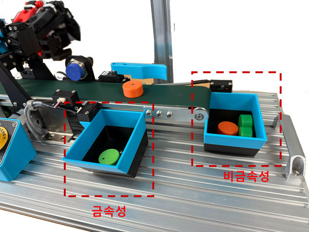

금속/비금속 작업물, 혹은 Stamp 작업물 미작업물을 선택적으로 분류합니다.

금속성과 Stamping 분류를 동시에 지원하지 않습니다.

**금속성**  
원 재료의 속성에 금속성 물질이 포함된 작업물이며 첫번째 작업물 적재소에 배출됩니다.

**비 금속성**  
원 재료의 속성에 금속성 물질이 미 포함된 작업물이며 두번째 작업물 적재소에 배출됩니다.

**Stamp 작업물**  
원 재료의 추가적으로 스탬핑 작업이 추가되어 생산된 작업물이며 첫번째 작업물 적재소에 배출됩니다.

**Stamp 미 작업물**  
원 재료의 추가적으로 스탬핑 작업이 생략되어 생산된 작업물이며 두번째 작업물 적재소에 배출됩니다.


## Hardware Block 
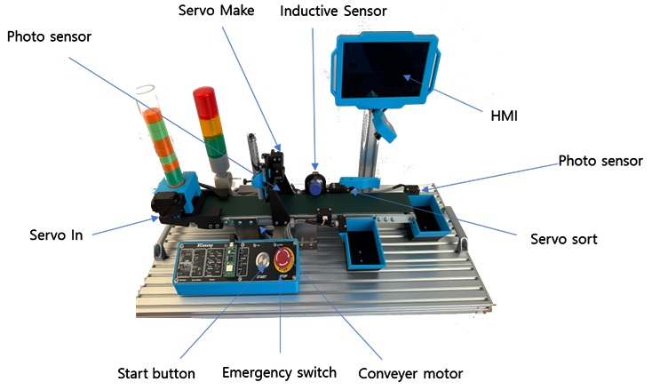

## Software Block 

AutoController 에는 Pico2 MCU firmware가 모든 기능을 제어합니다.
각종 엑츄에이터 센서의 값을 읽고 통제하는 인터페이가가 있으며, 시리얼 통신을 통해 현재 상태정보 제공 및 디바이스 제어를 담당합니다.
각 엑츄에이터 센서등의 개채는 각 기능을 담당하고 있습니다.
상층 SW에서는 모니터링 하는 UI에 데이터를 제공하는 모듈과 제어를 하는 개체가 있고 UI와는 현재 Multicast를 통해 연결되어 있습니다.
맨 상층부에는 각 기능을 사용자에게 제공하는 UI개체가 있습니다.

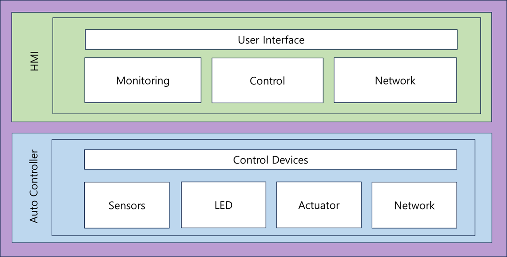

## 실습 환경
실습을 시작하려면 실습 장비에 전원을 공급한 후 PC와 Wi-Fi를 통해 무선 연결이 필요합니다. 최초에 한해 유선으로 PC와 HMI의 이더넷 포트를 연결해야 합니다.

### 유선 네트워크 연결 (최초 1회 필요)
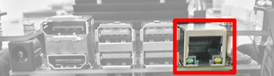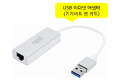

PC에 USB 이더넷 어댑터를 연결하면 자동으로 새로운 네트워크 장치가 추가되므로 엣지 디바이스와 통신하기 위해 다음과 같이 이곳에 새 IP 주소를 부여합니다. 이 과정은 새로운 USB 이더넷 어댑터를 사용할 때마다 진행해야 합니다. 아래의 과정이 완료되면 XConvey의 IP는 192.168.101.101로 할당됩니다.
    
    | 1 |	명령 프롬프트를 실행한 후 ncpa.cpl 명령 입력하고 엔터를 누름
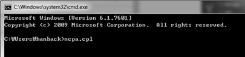


    | 2 |	새로 추가된 이더넷(Realtek USB GbE...)을 마우스 오른쪽 단추로 선택한 후 “속성” 선택. (이름은 PC마다 다를 수 있음)

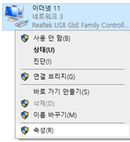

    | 3 |	속성창이 표시되면 목록에서 “인터넷 프로토콜 버전 4(TCP/IPv4)” 항목 더블클릭
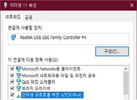

    | 4 |	인터넷 프로토콜 버전 4(TCP/IPv4) 창이 표시되면 “다음 IP 주소 사용”을 체크한 후 IP 주소와 서브넷 마스크를 “192.168.101.102”과 “255.255.255.0”로 설정. (나머지는 비워 둠)
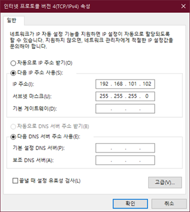

    | 5 |	“확인” 버튼을 눌러 설정 종료 


### 무선 네트워크 연결 


무선 네트워크에 연결하기 위해서는 최초 1회 유선 연결이 필요합니다. USB 이더넷 어댑터를 활용하여 PC 또는 노트북과 연결하고 웹브라우저를 실행하여 다음과 같이 IP를 입력합니다


접속 후 최초 한번 비밀번호를 묻는 창이 나타날 수 있습니다. 이때 비밀번호는 ‘soda’입니다. 이후 화면에서 ‘Other’ 부분의 ‘Terminal’을 실행합니다.

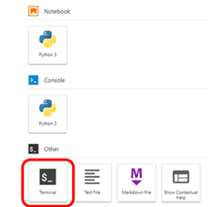

AutoCar를 공유기에 연결하기 위해서는 먼저 주변에 검색되는 Wi-Fi 목록을 확인해야 합니다. 이 Wi-Fi 목록을 확인할 때는 Terminal에서 다음 명령을 활용합니다

    | 1 |	sudo nmcli device wifi list
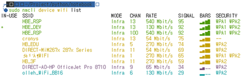


Wi-Fi 연결을 시도하는 경우에는 connect 옵션을 활용합니다. 입력하는 명령은 다음과 같습니다.
    | 2 |	sudo nmcli device wifi connect <SSID> password <PASSWORD>
위 명령에서 <SSID> 부분에 접속하고자 하는 Wi-Fi의 명칭을, <PASSWORD> 부분에 비밀번호를 입력합니다. 만약 비밀번호 설정이 없는 Wi-Fi라면 password 부분은 생략합니다.

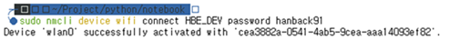

아래 명령을 활용하여 접속할 수 있는 IP를 확인합니다.
    | 3 |	ifconfig wlan0
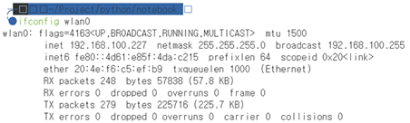
위에서 확인한 IP를 입력하여 XConvey로 접속할 수 있습니다.

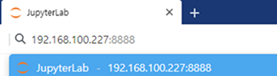


[101 개발환경]:https://github.com/PlanXStudio/meister/blob/main/common/101_개발환경.md


**Auto 제어기**  (PICO 보드에 직접 프로그래밍을 할 경우)
1. 제공되는 12V DC 전원 어댑터를 실습 장비의 전원 포트에 연결합니다. 

2. 실습 장비의 Micro USB Type B 커넥터와 PC의 USB Type A 커넥터를 제공되는 USB 케이블로 연결합니다.

3. PC의 장치 관리자에서 가상 시리얼 포트가 생성되었는지 확인합니다.


**USB 허브**   
여러 대의 실습 장비를 PC의 USB 포트에 직접 연결하는 대신, 제공된 USB 허브를 이용하여 한 번에 연결할 수 있습니다.

1. 5V USB 허브용 전원 어댑터를 USB 허브에 연결합니다.

2. USB 허브의 Micro USB 3.0 Type B 커넥터와 PC의 USB 3.0 Type A 커넥터를 제공되는 USB 허브 전용 케이블로 연결합니다.

3. 실습 장비를 PC 대신 USB 허브의 USB Type A 커넥터에 연결합니다.

4. PC에서 가상 시리얼 포트가 생성되었는지 확인하는데, 한 번에 하나씩 확인하면서 연결합니다.

**전원 공급기**    
여러 대의 Auto 제어기를 USB 허브를 이용하여 연결할 때 하나의 전원 어댑터로 통합하여 전원을 공급하면 더욱 편리하게 시스템을 운영할 수 있습니다. 이는 복수의 전원 어댑터를 사용해야 하는 번거로움을 줄여줍니다.

1. 제공되는 12V DC 전원 어댑터를 전원 공급기의 입력 포트에 연결합니다.

2. 별도 전원 케이블을 이용해 전원 공급기의 출력과 실습 장비의 전원을 연결합니다.

  

### 개발 툴 설치
VSCode, 파이썬 확장, 파이썬 SDK가 설치된 PC 환경에서 upy, micropython-magic과 같은 추가적인 도구 및 파이썬 라이브러리를 설치하여 개발 환경을 구축합니다.

**UPY**
upy는 명령행 도구로 마이크로파이썬 개발 환경을 확장하여 PC와 마이크로컨트롤러 간의 원활한 통신 및 코드 실행을 지원하는 툴입니다. 실습 장비의 초기화, 코드 업로드, 시리얼 통신, 파일 시스템 관리 등의 기능을 제공하여 효율적인 임베디드 시스템 개발을 가능하게 합니다.

```sh
pip install upyboard
```

**micropython-magic** 
마이크로파이썬 매직(micropython-magic)은 파이썬 개발 환경에서 마이크로파이썬 코드를 더욱 효율적으로 개발하고 실행할 수 있도록 돕는 강력한 도구입니다. 특히 Jupyter Notebook과 같은 환경에서 마이크로파이썬 코드를 작성하고 실행하는 것을 매우 편리하게 만들어줍니다.

```sh
pip install -U micropython-magic
```

## 시작하기

기본 firmware 를 업로드 합니다. (출고시 기본 설치되어 있습니다.)
HMI의 home 디렉터리의 smartfactory_mcast_v005.py , smartfactory-gui 디렉터리와, subdirectoies , smartfactory-gui/firmware/005/main.py, smartfactory-gui/firmware/005/core.py 등의 파일이 필요합니다.
```sh
upy put smartfactory-gui/firmware/005/main.py
upy put smartfactory-gui/firmware/005/core.py
upy repl
```
ctrl+c 

오토 제어기의 펌웨어는 준비가 끝났습니다.
    
### XConvey 기본 프로그램 실행

이제 HMI의 홈 디렉터리에서 다음을 실행합니다.
```sh
python smartfactory_mcast_v005.py
```

이제 다른 터미널 창에서 메인 UI를 실행합니다.
 ```sh
cd smartfactory-gui
python main.py
```

재료를 재료 공급기에 넣은후 시작 버튼을 누릅니다. 
기본 metal sort 방법으로 재료가 분류되는지 확인합니다.


### 첫 번째 마이크로파이썬 프로그램


실습 장비를 PC에 연결한 후 VSCode와 upy 툴을 이용해 실습을 진행합니다.


1. VSCode를 실행한 후 터미널 창을 선택합니다.

2. 터미널 창에서 scan 명령으로 PC에 연결된 실습 장비의 시리얼 포트를 확인합니다.

```sh
upy scan
```

> scan 명령은 시리얼 포트를 스캔하여 마이크로파이썬 환경이 구축된 장치를 감지하고, 해당 장치의 시리얼 포트 번호를 출력하는 기능을 제공합니다.
```out
/dev/ttyACM0	1.25  2025-03-25  rp2350a
```
3. 기존 저장된 main.py와 core.py 를 pc에 백업합니다.
upy get main.py .
upy get core.py .


4. init 명령은 실습 장비의 초기 상태를 설정하는 명령으로, 장비의 초기화가 필요한 경우에 한 번만 실행하면 됩니다. 이때, 앞서 확인한 시리얼 포트 번호를 옵션으로 사용합니다.
```sh
upy init
```

> init 명령을 실행하면 장비를 포맷합니다.
> 
```

5. ls 명령으로 실습 장비의 경로에 설치된 파일을 확인합니다.
```sh
upy put main.py
upy put core.py
upy ls
```

계산 식을 입력하면 결과를 반환하는 간단한 프로그램을 작성해 봅니다.

6. VSCode에서 simple_express.py란 이름으로 새 파일을 만든 후 다음과 같이 코드를 작성합니다.

```python
def setup():
    print("Start...")

def loop():
    exp = input("> ")
    try:
        ret = eval(exp)
        print(ret)
    except:
        print("Syntax Error")

if __name__ == "__main__":
    setup()
    while True:
        loop()
```


7. run 명령을 사용하면 완성한 simple_express.py 파일을 실습 장비에서 바로 실행해 볼 수 있습니다.

```sh
upy run simple_express.py
```

> run 명령은 로컬 시스템에 있는 파이썬 스크립트를 원격 장비로 전송하고 실행하는 기능을 제공합니다. 추가 옵션을 사용하지 않는 한 PC의 표준 입출력 스트림과 실습 장비의 표준 입출력 스트림을 시리얼 통신으로 연결하여 상호 작용을 가능하게 하므로, PC의 키 입력은 실습 장비의 input()으로 전달되고, 실습 장비의 print() 출력은 PC로 전달됩니다.
```out
Start...
> 3+4*5
23
> 
```

8. Ctrl+C 키 조합을 입력하면 시리얼 통신이 강제 종료되어 PC와 실습 장비 간의 연결이 끊어집니다. 하지만 실습 장비에서 실행 중이던 프로그램은 계속 동작합니다.

9. 실습이 끝난 후에는 필요시(메인 펌웨어를 수정한 경우) 이전 백업파일로 복원합니다.

upy put main.py /main.py
upy put core.py /core.py

10. upy repl 명령후, ctrl+c 를 하면 리붓되며 원래의 펌웨어가 실행됩니다.

