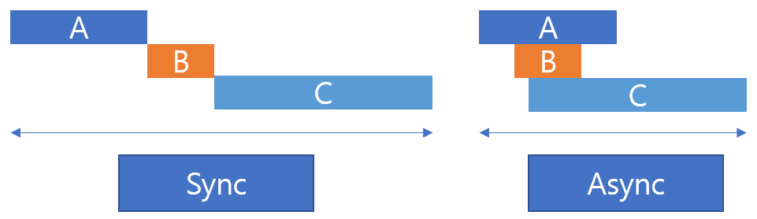

# 비동기 제어 
IoT 시스템에서는 센서 데이터를 수집하고 조건에 따라 실시간으로 액추에이터를 제어해야 합니다. 이때, 비동기 프로그래밍 기법을 활용하면 여러 센서나 장치를 동시에 처리할 수 있습니다.

## 동기방식과 비동기 방식의 차이 
예를 들어 A,B,C 라는 작업을 수행하는데, 작업에 수행되는 시간이 A는 5초, B는 10초, C 는 15초 가 걸린다고 가정해보겠습니다. 이를 순차적으로 처리하면 총 30초가 소요됩니다. 하지만 작업을 순차적으로 처리하는 것이 아닌 비동기 방식으로 처리하면 약 15초 만에 모든 작업이 완료됩니다. 



동기 방식과 비동기 방식을 요약해서 정리하면 다음과 같이 정리할 수 있습니다. 

| 항목 | 동기 방식 | 비동기 방식 |
|:-------|:------|:------|
| 실행 방식 | 순차 실행 | 동시 실행 | 
| 총 작업 시간 | 모든 작업 시간 누적 | 가장 긴 작업 시간에 근접 | 
| 사용 예시 | DB 트랜잭션, 시리얼 처리 등 | 센서 데이터 수집, 네트워크 요청 등 | 

### 동기 방식 예시 
```python
import time

def task_sync(name, duration):
    print(f"{name} start")
    time.sleep(duration)
    print(f"{name} end")

def run_sync_tasks():
    start = time.time()
    task_sync("A", 5)
    task_sync("B", 10)
    task_sync("C", 15)
    end = time.time()
    print(f"Total: {end - start:.2f}sec")

if __name__ == "__main__":
    run_sync_tasks()
```

### 비동기 방식 예시 
```python
import asyncio
import time

async def task_async(name, duration):
    print(f"{name} Start")
    await asyncio.sleep(duration)
    print(f"{name} End")

async def run_async_tasks():
    start = time.time()
    await asyncio.gather(
        task_async("A", 5),
        task_async("B", 10),
        task_async("C", 15)
    )
    end = time.time()
    print(f"Total: {end - start:.2f}sec")

if __name__ == "__main__":
    asyncio.run(run_async_tasks())
```

## asyncio 
asyncio는 파이썬에서 비동기 I/O 처리하기 위한 표준 라이브러리 모듈입니다. 복잡한 스레드나 프로세스 없이도, 단일 스레드 내에서 수많은 네트워크 요청, 타이머, 웹소켓 과 같은 작업들을 효율적으로 동시 실행할 수 있게 해줍니다. 

### asyncio 작동 원리 
asyncio는 이벤트 루프 기반으로 동작합니다. 하나의 이벤트 루프가 있으며, async def로 정의된 코루틴(coroutine) 들이 등록됩니다. await 키워드를 통해 현재 비동기 작업을 일시 중단하고 대기중인 다른 작업을 수행할 수 있게 합니다. 

### 주요 구성 요소 

- async def : 비동기 함수 정의, 코루틴 객체를 생성 
- await : 코루틴 실행 중 일시 중단, 호출 시 다른 작업에 CPU 양보 
- asyncio.run() : 이벤트 루프 생성 및 코루틴 실행 
- asyncio.create_task() : 여러 코루틴을 통시에 실행하는 태스크 
- asyncio.sleep() : 비동기 타이머, 논블로킹(non-blocking) 방식으로 실행
    - time.sleep() 을 사용하면 블로킹 상태가 되어 비동기 처리와는 맞지 않음! 

## 비동기 센서 데이터 수집 
### Photo Sensor 데이터 수집 1 (동기 방식)
XConvey의 2개의 Basket에 있는 Photo 센서의 데이터를 수집해 보겠습니다. 우선 순차적으로 수집한 후 출력하는 방식의 예시입니다. 

```python
import time
from xconvey import Sorting

sorting = Sorting()

def run_sync_task():
    start_time = time.time()
    for i in range(10):
        print("Current hit basket count: " + str(sorting.hit_count))
        time.sleep(0.5)
        print("Current normal basket count: " + str(sorting.normal_count))
        time.sleep(1)
    end_time = time.time()
    print("Total time : " + str(end_time - start_time))

if __name__ == "__main__":
    run_sync_task()
```

### Photo Sensor 데이터 수집 2 (비동기 방식)
동기식으로 수집하던 센서 데이터를 비동기 형태로 수집하는 방식으로 변경하면 다음과 같이 구성할 수 있습니다. asyncio 모듈을 활용하고, time.sleep() 으로 지연이 발생하던 부분을 asyncio.sleep()을 통해 CPU를 점유하지 않고 다른 작업을 진행할 수 있도록 구성한 것입니다. 

```python
import asyncio
import time
from xconvey import Sorting

sorting = Sorting()

async def run_hit_count():
    for i in range(20):
        print("Current hit basket count: " + str(sorting.hit_count))
        await asyncio.sleep(0.5)
    
async def run_normal_count():
    for i in range(10):
        print("Current normal basket count: " + str(sorting.normal_count))
        await asyncio.sleep(1)
    
async def run_async_tasks():
    start_time = time.time()
    await asyncio.gather(
        run_hit_count(),
        run_normal_count()
    )
    end_time = time.time()
    print("Total time : " + str(end_time - start_time))

if __name__ == "__main__":
    asyncio.run(run_async_tasks())
```

### 조건에 따른 태스크 종료 
앞선 비동기 구조에서 한걸음 더 나아가, 특정 조건에 따라 태스크를 동적으로 종료할 수 있는 구조입니다. 이벤트를 통해 각 태스크 간 신호를 전달하도록 구현하는 것이 핵심입니다. Security 블록에 Start 스위치의 눌림 여부에 따라 태스크를 종료 하도록 구성하면 다음과 같이 작성할 수 있습니다. 

```python
import asyncio
import time
from xconvey import Sorting, Safety

sorting = Sorting()
safety = Safety()

async def run_hit_count():
    while not safety.sw_start:
        print("Current hit basket count: " + str(sorting.hit_count))
        await asyncio.sleep(0.5)
    
async def run_normal_count():
    while not safety.sw_start:
        print("Current normal basket count: " + str(sorting.normal_count))
        await asyncio.sleep(1)
    
async def run_async_tasks():
    start_time = time.time()
    await asyncio.gather(
        run_hit_count(),
        run_normal_count()
    )
    end_time = time.time()
    print("Total time : " + str(end_time - start_time))

if __name__ == "__main__":
    asyncio.run(run_async_tasks())
```

