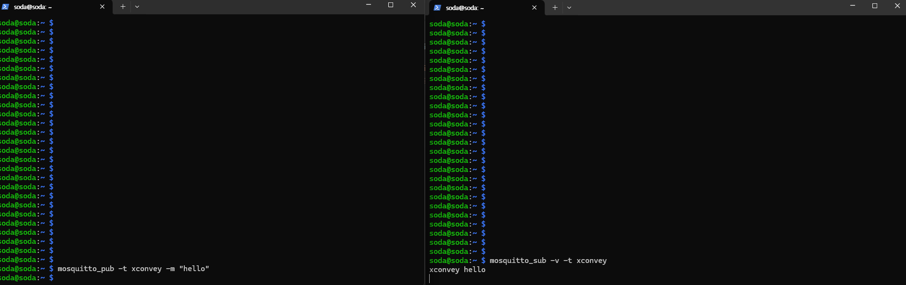
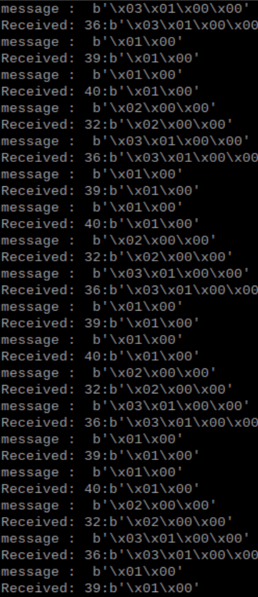

### 시리얼-MQTT 브릿지

시리얼-MQTT브릿지는 시리얼을 통해 연결된 장치의 데이터를 MQTT로 연결시켜주는 역할을 수행합니다. 다시 말해 시리얼 MQTT 브릿지는 HMI 호스트 Machine과 시리얼통신으로 연결된 MCU, MCU에 연결된 종말 디바이스를 제어하거나 상태값등을 송수신하여 데이터를 외부의 구독자에게 전달하는 역할을 수행합니다. 또한 Micropython에서는 umqtt의 패키지를 통해 mqtt를 사용할 수 있습니다.


다음 예제코드를 실행하기 위해서는 하기의 명령을 통해 mqtt broker 모듈을 설치합니다.

```sh
pip install serial
pip install paho-mqtt
```
```sh
sudo apt-get update && sudo apt-get upgrade

sudo apt-get install mosquitto

sudo /etc/init.d/mosquitto start
```

- 동작 확인
각각 다른 shell 창에서 다음과 같이 입력합니다.
mosquitto_sub -v -t [토픽명]
msquitto_pub -t [토픽명] -m [메시지]

```sh
mosquitto_pub -t xconvey -m "hello"
mosquitto_sub -v -t xconvey
```




### 시스템 UART통신 내용을 MQTT로 수신하는 방법

MQTT가 패치된 키트에서는 다음과 같은 코드로 시스템에서 보내는 topic을 볼 수 있습니다.
관련 Protocol은 2-6. Protocol.MD 에서 확인 할 수 있습니다.

```python


import paho.mqtt.client as paho
import time

def on_connect(client, userdata, flags, rc):
  client.subscribe("xconvey")

def on_message(client, userdata, message):
    
    prefix = message.payload[0]
    print("message : ", message.payload[1:])
    text_data = message.payload[1:]
    print(f"Received: {prefix}:{text_data}")
    
client = paho.Client()
client.on_connect = on_connect
client.on_message = on_message

client.connect("localhost", 1883)
client.loop_forever()

```

실행 결과는 다음과 같습니다.




* 다음 예제코드는 serial-MQTT 브릿지 오픈 소스 입니다.


<a href="https://github.com/hanback-lab/XConvey/blob/main/src/external/mqtt/serialmqtt_bridge.py">https://github.com/hanback-lab/XConvey/blob/main/src/external/mqtt/serialmqtt_bridge.py


