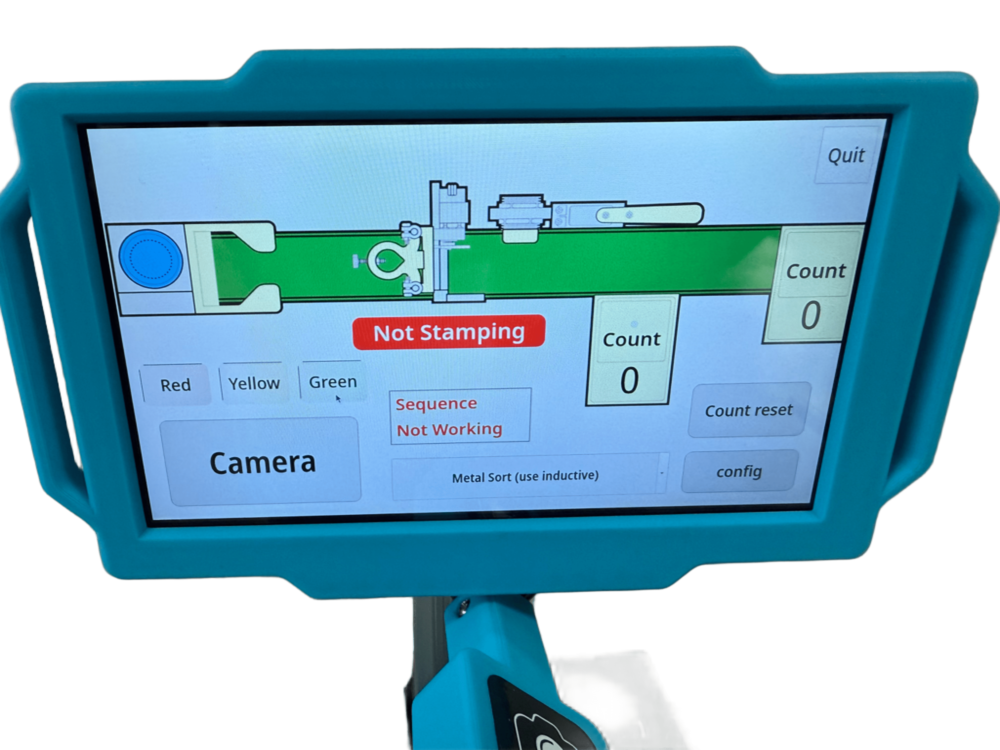
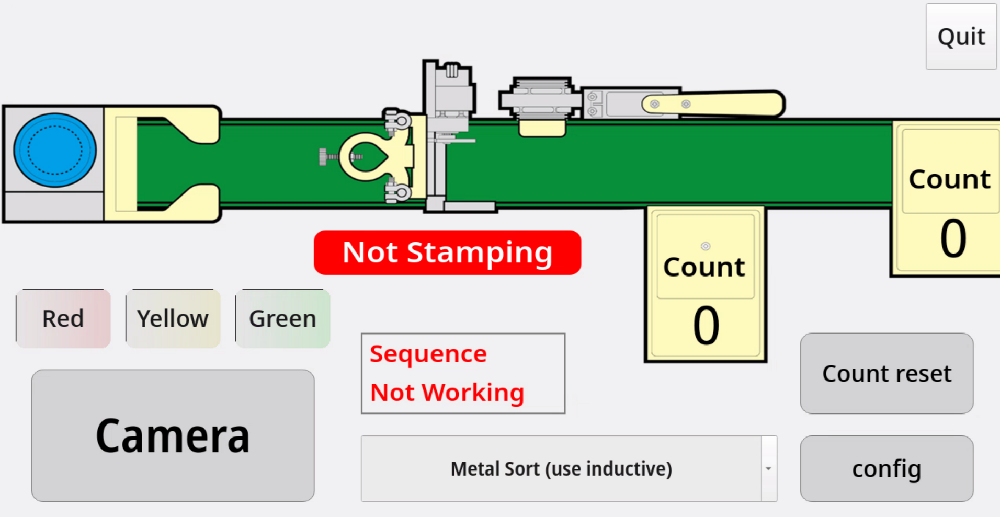
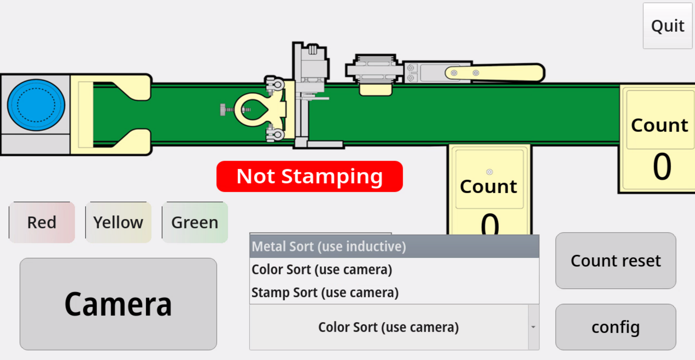
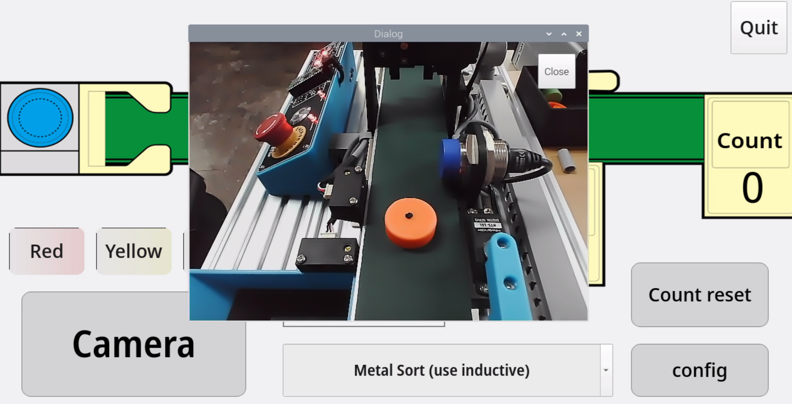
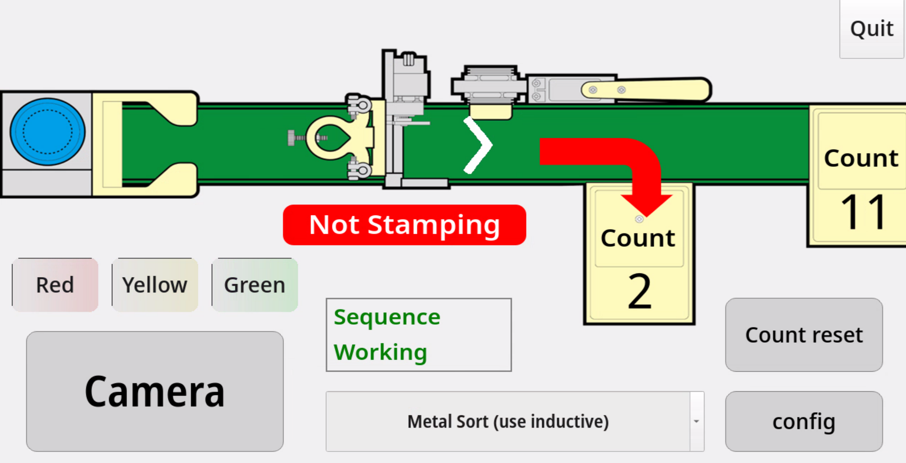
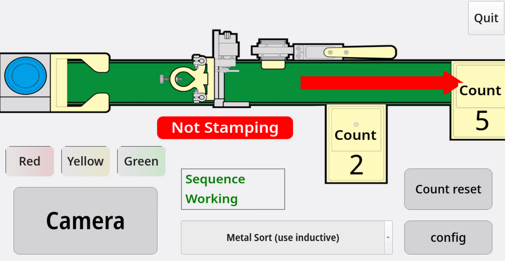
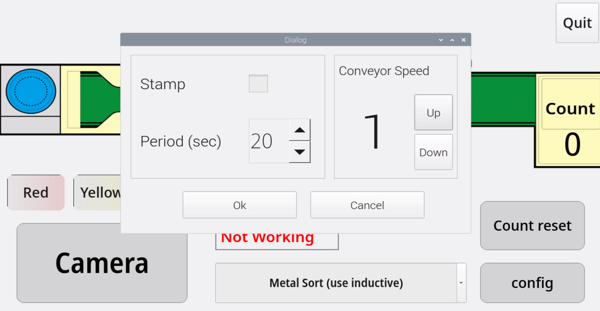
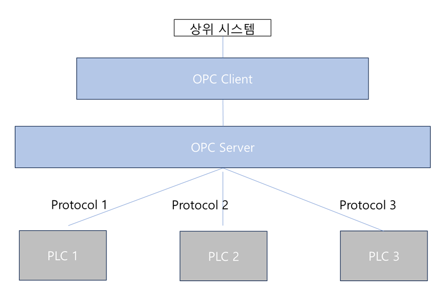

# HMI (Human Machine Interface)
HMI는 사용자와 기계간의 상호작용을 가능하게 해주는 인터페이스입니다. 자동화 산업에서 기계와 작업자 간의 통신을 원활하게하여 작업 효율을 높이는데 사용됩니다. 사물 인터넷(IoT) 환경에서 데이터를 수집하고 전송하며, 데이터를 시각화 하는 용도로도 활용됩니다. 
XConvey의 HMI는 Linux 계열의 OS를 기반으로 다양한 프로그래밍 언어를 처리할 수 있으며, Wi-Fi나 Bluetooth를 통해 무선 통신기능을 포함하고 있습니다. 




### Auto 제어기 연동
Auto 제어기는 시리얼 통신으로 제어 할 수 있습니다. 제어기의 펌웨어 main.py 를 살펴보면 시리얼 통신을 이용하여 HMI에 각종 데이터를 보내고, 시리얼 통신으로 제어정보를 받아 각 기기를 제어하는 것을 볼 수 있습니다.

### 파이썬 시리얼

파이썬에서는 시리얼을 쉽게 이용할 수 있는 모듈을 제공합니다.
다음 명령으로 파이시리얼 모듈을 설치합니다.
```sh
pip install serial
```

```out
import serial

# 시리얼 포트 설정
ser = serial.Serial('/dev/ttyACM0', 115200, timeout=1)

# 데이터 쓰기
ser.write(b'Hello, World!')

# 데이터 읽기
data = ser.read(10)  # 10바이트를 읽습니다.
print(data)

# 포트 닫기
ser.close()

```

### GUI 설계

HMI에서 실제 사용자에게 보여지는 GUI를 설계합니다.


#### 기능 명세

- Sensor 데이터 모니터링
- Actuator 제어
- Camera 모니터링 + 인공지능 모델 (객체 탐지 및 분류)
- 특정 동작 탐지 및 실행

#### 메인 UI
&nbsp;
- 메인화면 : 전체 공정의 상태가 화면에 표시됩니다.
1. 오토 제어기 시작 버튼에 의해 가장 먼저 DC모터에 의해 컨베이어 벨트가 작동됩니다. 초록색 부분이 컨베이어벨트 입니다.
2. 파란색 동심원으로 그려진 재료 공급기에서 원재료가 서보모터1에 의해 투입되면 Stamping 공정의 실행여부가 config UI에 의해 결정되고 이에 따라 서보모터2가 동작하여 스탬핑을 실행합니다.
3. Inductive 센서에 의해 금속(이물질)이 포함된 가공물을 판별하고 서보모터3에 의해 분류막대가 움직여 가공물을 분류합니다.
4. 분류 방법은 금속성/비금속성 재료 혹은 색상 혹은 스탬핑 공정유무에 따른 분류가 가능합니다. 각 분류기에 누적 카운터가 센서 감지에 의해 증가됩니다.




&nbsp;
- 분류 방법을 선택합니다. 하기와 같은 분류 방법을 지원합니다.
1. 금속/비금속 분류
2. 스탬핑 공정에 따른 분류
3. 색상에 따른 분류



&nbsp;
- 카메라 뷰
컨베이어벨트에서 Inductive 센서를 거쳐 이동하는 작업물을 모니터링하여 화면에 출력합니다. 



- metal의 경우 화면 하단의 적재소로 이동하는 화살표를 출력합니다.



- non-metal의 경우 화면 오른쪽쪽의 적재소로 이동하는 화살표를 출력합니다.



- LED 버튼 
RED/YELLOW/GREEN LED를 표시할 수 있습니다.
 
- 카운트 출력기
카운트된 분류별 카운트를 모니터링 할 수 있습니다.

- config 창
컨베이어 모터 속도 제어, 스탬프 공정 적용여부, 스탬프 적용시 Period time 등을 설정할 수 있습니다.



### PLC 연동기술

&nbsp;

### ModBus 

1979미국의 Modicon 사가 개발한 직렬 통신 프로토콜로서
산업용 전기 장비에서 데이터를 전송하기 위해 사용되는 통신 프로토콜로, 최초에는 Modicon 사 ( 현재 슈나이더 일렉트릭에 인수 )의 PLC 간 통신을 위해 개발되었습니다. 국제 표준으로 지정된 적은 없지만, HMI와 같은 PLC 관련 장치들은 대부분 Modbus를 지원합니다.

#### ModBus 종류
- Modbus RTU : 산업현장에서 일반적으로 쓰이는 바이너리 데이터 전송방식.
- Modbus ASCII : ASCII 문자를 사용하는 텍스트형 전송방식.
- MODBUS TCP/IP : Modbus RTU와 비슷하지만, TCP/IP를 사용.

- Master : 네트워크에서 주도적 역할을 수행, 통신제어권(O), 명령전송 및 대기 
- Slave : 마스터의 요구에 반응하는 장치, 통신제어권(X), 명령수행 후 결과 반환

- 시리얼 통신에서는 Modbus가 physical/link layer이기 때문에, Error Check가 필요합니다.
반면 Modbus TCP의 경우 자체 Error Check 기능이 있으므로 생략됩니다.

- Error Check: 
체크섬을 통해 에러를 체크하는 부분입니다. ASCII와 RTU가 서로 다른 방식을 사용합니다.

데이터 타입은 다음과 같습니다.
|이름|설명|예|
|:---|---:|:---:|
|Discrete Input|Read only bit|PIR|
|Coils|Read Write bit|Switch|
|Input Registers|Read only word|가속센서|
|Holding Registers|Read Write word|모터 제어|


##### RTU 방식
프레임 본문을 이진 형식으로 표현하는 방식으로 ASCII 방식에 비해 프레임 당 전송하는 데이터가 거의 절반으로 효율적입니다.
Start (>=3.5char) + Address(8bit) + Func.(8bit) + Data (N*8bit) + CRC(16bit) + End(>=3.5char)

- Start / End : 각 프레임영역을 식별하기 위한 구간
- Address : Slave Address
- Function Code : 실패시 MSB 1bit가 1로 설정. 성공시 0 따라서 127개의 식별 코드를 갖습니다.


|타입|코드|대상타입|기능|
|:---|---:|:---:|:---:|
|Read|01/0x01|bit|read coil|
|Read|02/0x02|bit|read discrete input|
|Read|03/0x03|word|read holding registers|
|Read|04/0x04|word|read input registers|
|WRITE|05/0x05|bit|write single coil|
|WRITE|06/0x06|word|write single register|
|WRITE|15/0x0F |bit|write multi coils|
|WRITE|16/0x10 |word|write multi registers|
|WRITE|23/0x17 |word|read/write multi registers|
...
&nbsp;
##### ASCII 방식

프레임 본문을 ASCII 형식으로 표현하는 방식으로 0-9 , A-F 문자를 이용해서 16진수 문자를 그대로 ASCII로 옮기면 됩니다. ( Error Check 부분은 LRC => ASCII 2문자로 변경됨 )

|Start|Address|Function|Data|LRC|End|
|:---|---:|:---:|:---:|:---:|:---:|
|;|2chars|2chars|N*1char|2chars|CR/LF|

Start ; + Address (2chars) + Function (2chars) + Data(N*1 char) + LRC (2 chars) + End (CR/LF)

##### TCP 방식
Modbus TCP는 TCP / IP 프로토콜, 즉 인터넷 통신을기존 Modbus 프로토콜에 도입한 버전입니다.


[Serialbus message frame] 에서 checksum 이 제외된 형태를 가집니다.
|Address|Function|Data|
|:---|---:|:---:| 
checksum(없음)


#### MBapHeader : MBap(Modbus Application Protocol) Header
- 7byte 바이트로 TransactionID, ProtocolID, Length, UnitID 로 구성됩니다.
- TransactionID (2byte) : 마스터가 1씩 증가시키는 값. 슬레이브는 그대로 사용. 질의/응답이 한쌍을 이루는지 확인하는 데 사용됩니다.
- ProtocolID(2byte) : 모드버스는 0x0000 의 고정값을 가집니다.
- Length(2byte) : 필드 위치에서 마지막까지의 길이를 나타냅니다. (UnitID ~ Data 끝)바이트 수.
- UnitID(1byte) : TCP/IP 이외의 통신설로에 연결된 slave 를 구분하는 플래그 TCP/IP는 0x01 로 고정됩니다.

[Modbus TCP]:
PDU 앞에 MBapHeader 즉, Transaction ID, Protocol ID, Length, Unit ID가 추가됩니다.
|Transaction ID|Protocol ID|Length|Unit ID|Function|Data|
|:---|---:|:---:|:---|:---:|:---:|

[PDU]: Function + Data가 부착된 형태입니다.
자체 checksum이 있어 추가적인 checksum checking을 하지 않습니다.
|Function|Data|
|---:|:---:|

정리하면, 각 3개의 타입들은 serial 혹은 그로부터 파생한 것으로 function code 및 데이터가 핵심입니다.
checksum은 데이터의 무결성을 보장하지 않는 영역에서 추가됩니다.

### OPCUA

 OPC-UA (Open Platform Communications Unified Architecture)는 개방형 플랫폼 통신 프로토콜 입니다.
 제각각의 PLC 장비와 상위 시스템과의 통신에서 표준화된 프로토콜을 제공하여 어떤 PLC도 표준프로토콜을 따르게 하여,
 OPCServer는 OPC Client를 통해 쉽게 제어 및 모니터링을 수행할 수 있습니다.



 
&nbsp;
#### Python OPCUA 예제

예제 실행을 위해 다음과 같은 모듈을 설치한다
```sh
pip install opcua
```

다음 예제는 온도의 변화값을 받는 예제코드입니다.

```out
from opcua import Client
#로컬 PC에 OPCUA 서버가 설치 되어 있고 4840 포트에서 서비스 한다고 가정한다.
server_url = "opc.tcp://localhost:4840"
client = Client(server_url)

try:
    client.connect()
    #nodeId: "ns=1;s=Temperature" 
    #노드 아이디에 네임스페이스 1, 스트링 타입 아이디를 가정한다.
    temp_node = client.get_node("ns=1;s=Temperature")
    temp = temp_node.get_value()
    print(f"현재 온도: {temp}°C")

finally:
    client.disconnect()
```

 Pub/Sub

 Publish / Subscription 입니다. 발행과 구독을 의미합니다. 정보를 제공하는 것을 Publish라고 하고, 이 정보에 관심을 갖고 계속적으로 받는 설정을 하는 것을 Subscription이라고 합니다.

&nbsp;

### 시간 모니터링 시스템 구축

공정의 시간 모니터링 시스템은 공정 각 단계의 시간을 측정하고 모니터링하여 불필요한 시간을 줄여 생산성을 높여줍니다.
주요 기능은 다음과 같습니다.
- 실시간 데이터 수집: 공정의 각 단계의 시간을 수집하여 실시간 모니터링합니다.
- 데이터 분석: 시간 데이터를 분석하여 공정의 흐름을 파악하고, 병목현상을 식별합니다.
- 시각화:
데이터 분석 결과를 시각화하여 사용자에게 공정의 상태를 명확하게 보여줍니다.
- 알람 및 경고: 이상상황 발생시 자동으로 알림을 보내 사용자에게 알려줍니다.
- 보고서 생성: 시간데이터를 바탕으로 다양한 보고서를 생성하여 공정의 상태를 추적하고 개선방안을 모색할 수 있게 해줍니다.
-시스템 통합: ERP, MES등 다른 시스템과 연동하여 통합적인 관리 시스템을 구축할 수 있습니다.

#### 공정시간 모니터링 시스템의 장점
- 생산성 향상 : 공정의 효율성을 높여 생산성을 향상시킬 수 있습니다.
- 불량률 감소 : 공정의 흐름을 파악하고 병목현상을 해결하여 불량률을 감소시킬 수 있습니다.
- 비용 절감 : 에너지 낭비나 불필요한 작업시간을 줄여 비용을 절감합니니다.
- 품질 유지 : 공정의 일관성을 유지하여 일정한 품질을 유지할 수 있습니다.
- 예지 보전 : 설비의 가동 시간 데이터를 모니터링하여 예지 보전을 수행하여 설비 고장으로 인한 손실을 최소활 할 수 있습니다.


### 센서 데이터 시각화 및 원격 제어

본 키트의 각 센서데이터는 0/1 의 데이터를 송출합니다.
Inductive Sensor/PIR Sensor의 데이터를 공정 Flow에 맞게 시각화하여 시간 모니터링 시스템과 통합할 수 있습니다. 또한 센서의 입력에 따른 다음 동작의 행동 방향, delay 값들을 조절하여 공정을 컨트롤 할 수 있습니다.


### 이상 감지 및 알림 시스템 구축 

이상 감지시 이를 자동으로 Slack등의 Officeware와 연동하여 해당 사용자에게 Notify를 할 수 있습니다. 예를 들어 색상별 분류의 경우, 해당되는 색상이 감지 되지 않는 경우, 생산 갯수가 한번에 두개이상 상승하는 경우 이상 동작으로 판별될 수 있습니다. 


다음 예제는 slack을 통해 알림을 보내는 코드 입니다.
```python
from slack_sdk import WebClient
from slack_sdk.errors import SlackApiError
from smartfactory import Inductive
import time 

slack_token = "your device token"
client = WebClient(token=slack_token)
inductive = Inductive()
while True:
    try:
        data = inductive.read()
        if data > 20:
            response = client.chat_postMessage(channel="your channel id",text=str("counter overflow warning"))
    except SlackApiError as e:
        assert e.response["error"]
    time.sleep(1)
```

다음 예제는 메시지를 수신하는 코드입니다.
```python
from slack_sdk import WebClient
from slack_sdk.errors import SlackApiError
from smartfactory import Inductive
import time 

slack_token = "your device token"
client = WebClient(token=slack_token)
inductive = Inductive()
while True:
    try:
        data = inductive.read()
        if data > 20:
            response = client.chat_postMessage(channel="your channel id",text=str("count overflow warning"))
    except SlackApiError as e:
        assert e.response["error"]
    time.sleep(1)
```


<details>
<summary>연습문제</summary>

## 생산 갯수 변화 GUI 
본 키트의 소스중 smartfactory 라이브러리에는 PhotoSort1, PhotoSort2 라는 생산물 카운터가 존재합니다. 상기 예제를 사용하여 다음 Application 을 작성해 보세요.
PhotoSort1 과 같은 센서에는 read라는 함수가 있으며, 각 소팅된 갯수를 반환합니다.

- 메인 윈도우 
    - 총 생산 count 갯수가 5개를 넘는 경우 알람을 보낼것.
