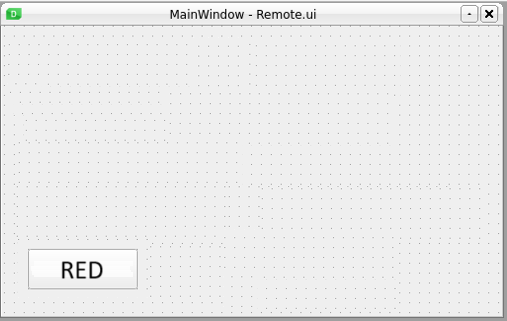
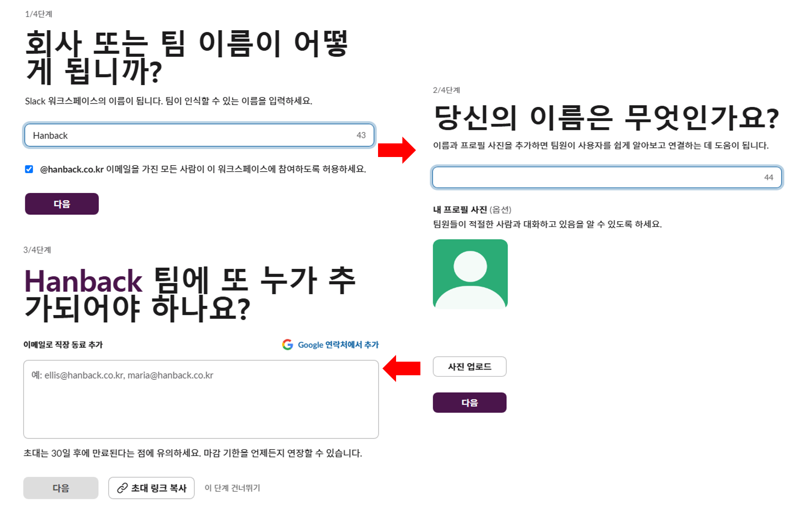
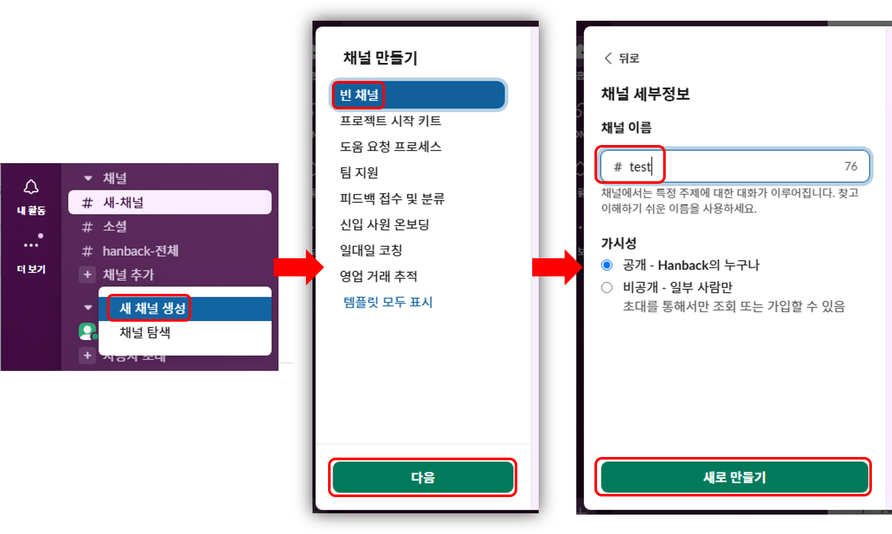
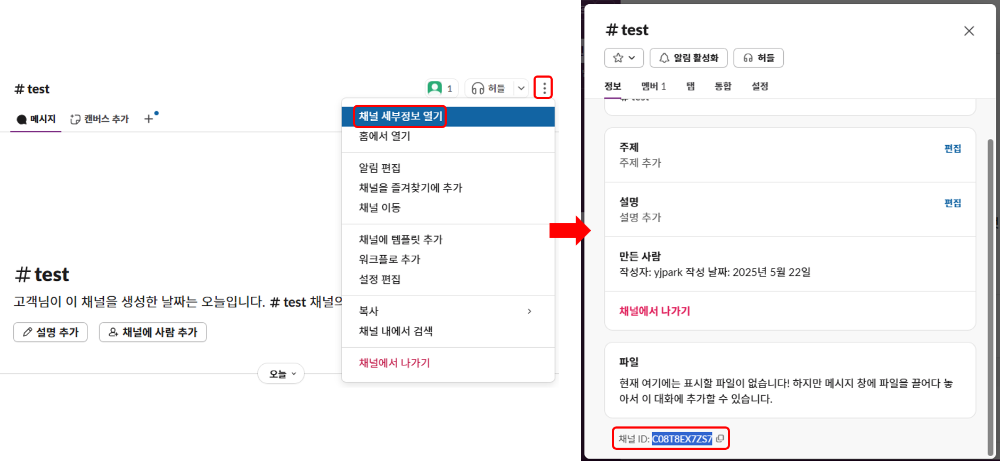
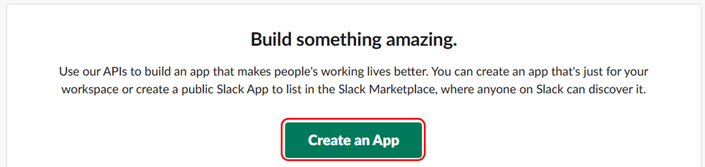
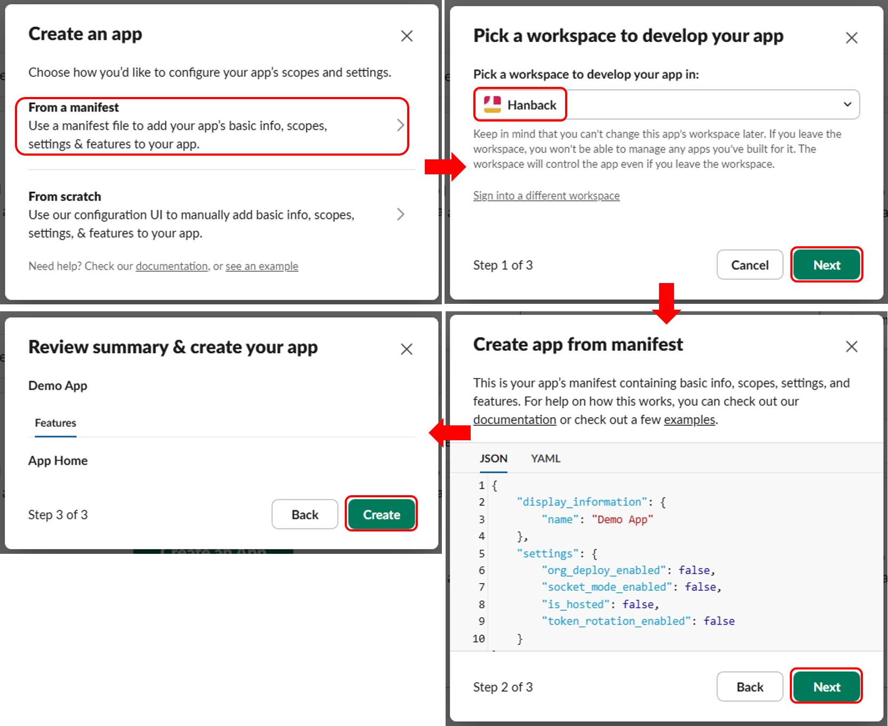
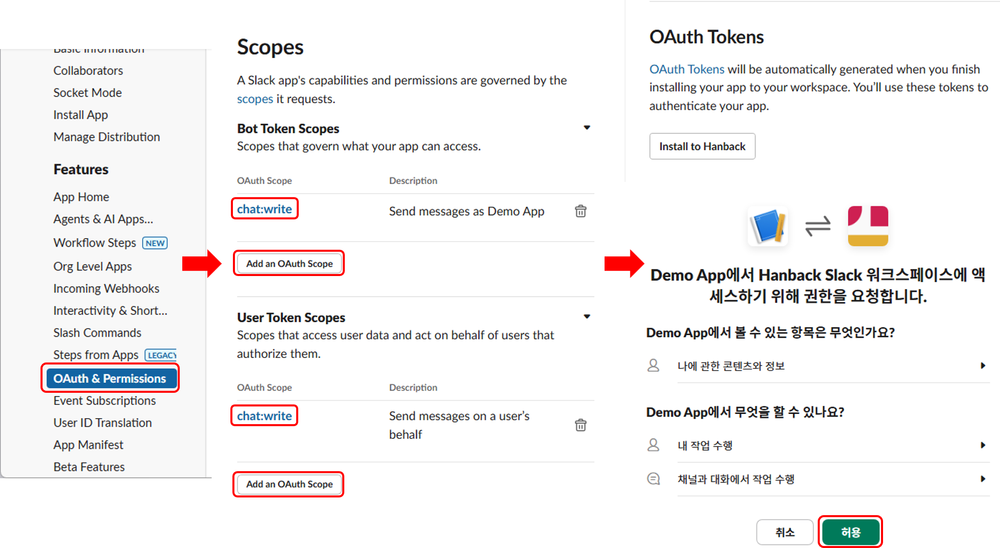
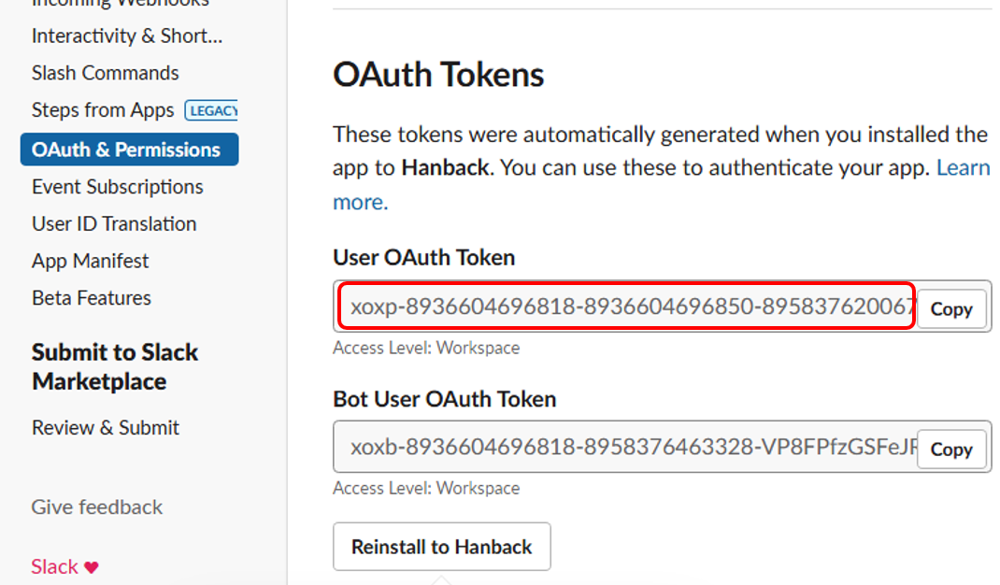
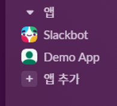

# 실시간 모니터링 시스템 구현 

## 나만의 XConvey Controller 
'3-3. GUI' 내용을 바탕으로 xConvey 제어 프로그램을 작성해 보겠습니다. 작성할 프로그램에 필수로 적용되어야 하는 내용은 다음과 같습니다. 

>- 액츄에이터 
>    - LED 
>        - RED LED On 또는 Off 버튼 제어 
>  
### UI 구성
앞서 작성한 숫자 맞추기 게임의 UI 구성은 별도의 UI 구성툴을 활용하지 않고 코드로 직접 하나씩 작성한 형태로 위젯의 배치를 좌표로 하나씩 지정해야 하기에 수정하기에 불편한점이 있습니다. 이번에는 Qt에서 UI 구성을 위해 제공하는 Qt Designer 를 활용하여 별도의 코드를 작성하지 않고 UI 배치를 진행 해보겠습니다. 

Qt Designer는 PySdie6를 설치할때 함께 설치되며 다음 명령을 통해 실행할 수 있습니다. 
```sh
pyside6-designer 
```


Qt Designer는 UI 환경에서 원하는 위젯을 선택적으로 드래그&드롭 을 통해 배치하고 크기를 조정할 수 있습니다. 앞서 코드를 통해 작성하는 방법 보다는 보다 수월하고 빠르게 UI를 구성할 수 있습니다. 

새로운 UI 생성을 진행합니다. 생성할 UI는 Templates를 선택합니다. "Main Window" 를 선택하면 기본적인 창 구성이 가능합니다. 다음은 XConvey Controller UI 구성입니다. 



앞의 그림에 표기된 UI 에는 눈으로 확인되지 않는 Label을 포함하여 14개의 Label과 4개의 PushButton, 1개의 ComboBox로 이루어집니다. 각각의 위젯의 기본값 설정은 다음과 같습니다. 

**여기서 Geometry 는 꼭 아래의 내용을 따르지 않아도 되며 원하는대로 구성해도 관계 없습니다.**

| Class | Object Name | Description | Geometry | Default Value | 
|:-------|:------|:------|:------|:------|
| QLabel | REDLEDLbl | 문자 표기 | [(20,20),41x41] | RED |
| QPushButton | dREDLEDBtn | RED LED | [(20,230),111x41] | ON |

작성한 파일을 Remote.ui 로 저장합니다. .ui 확장자를 사용하는 파일은 Qt Designer로 만든 GUI 레이아웃을 저장하는 XML 형식의 파일입니다. 파이썬 코드를 작성하지 않고 UI의 구성 요소를 설계하고 저장할 수 있습니다. .ui 파일은 파이썬 파일로 변환하여 사용합니다. 변환툴은 PySide6를 설치할때 함께 설치되며 변환 명령은 다음과 같습니다. 
```sh
pyside6-uic <file_name>.ui -o <file_name2>.py
```

작성한 Remote.ui 파일을 변환하게되면 다음과 명령으로 파이썬 파일로 변환할 수 있습니다. 
```sh
pyside6-uic Remote.ui -o Remote.py 
```

이렇게 생성된 UI 관련 파이썬 파일은 파일을 직접 수정해서 활용도 가능하지만 UI 구성의 편의와 작업 시간 단축을 위해 Qt Designer를 활용하는것을 추천합니다. 이제 이 파일을 어플리케이션 프로그램에서 import 해서 활용하면 됩니다. 

### XConvey Controller 어플리케이션  
UI 파일을 기반으로 동작 코드를 구현합니다. 빨간색 LED를 점등하는 앱을 작성해봅니다.

```python
import sys
from PySide6.QtWidgets import QApplication, QMainWindow
from PySide6.QtCore import QTimer 
from Remote import Ui_MainWindow
from smartfactory import Light

class Window(QMainWindow):
    def __init__(self):
        super().__init__()
        self.ui = Ui_MainWindow()
        self.ui.setupUi(self)
        self.__REDLED = Light()
        
        self.ui.dREDLEDBtn.clicked.connect(self.REDON_clicked)
        
        

    def REDON_clicked(self):
        if self.sender().text() == "ON":
            self.self.__REDLED.on("red")
        else:
            self.self.__REDLED.off("red")
        

app = QApplication(sys.argv)
window = Window()
window.show()
app.exec()
```


## SNS를 활용한 상태 알림 시스템 구현 

### Slack 
Slack은 팀 커뮤니케이션을 위한 협업 도구로, 채팅 기반의 실시간 메시지, 파일 공유, 알림 연동 기능을 제공합니다. 다양한 외부 서비스와의 연동을 통해 업무 자동화와 정보 공유를 간편하게 할 수 있습니다. 채널 단위로 대화를 분리하여 프로젝트별 또는 주제별로 효율적인 협업이 가능합니다.

- [Slack Homepage](https://slack.com/)

웹 페이지 및 데스트톱 클라이언트 그리고 모바일에서 설치하여 활용할 수 있으며 파이썬을 통해 특정 채널에 메시지를 송신하는등의 기능을 활용할 수 있습니다. 

- [Slack Python SDK Documents](https://tools.slack.dev/python-slack-sdk/)

우선 Slack 활용을 위해 회원가입을 진행합니다. 회원가입은 이메일을 통해 인증절차를 활용하여 진행되며 이메일로 전송된 코드를 입력하면 회원가입 절차는 완료됩니다. 

이제 워크 스페이스를 생성합니다. 


약관 동의를 진행하고 회사이름, 유저이름, 워크스페이스를 함께 사용할 사용자 등을 등록합니다. 함께 사용할사용자가 없다면 건너뛰어도 관계없습니다. 



slack은 유료 버전과 무료버전이 있습니다. 여기서는 무료버전을 활용한 기본 테스트를 진행합니다. 기본 워크스페이스가 생성되면 채널 정보, 유저정보, 외부앱 (구글 드라이브 등..) 연동하여 활용할 수 있습니다. 

테스트 채널을 생성하겠습니다. 좌측 메뉴중 채널 메뉴 하위에 "채널 추가" 를 누르고 채널 이름 등의 정보를 입력하여 생성합니다. 



채널이 생성되면 채널내에서 채팅이 가능합니다. 여기서 우측 상단의 채널 메뉴를 열어 세부정보를 확인합니다. 알림등의 설정은 원하는대로 설정하되, 하단의 채널 ID 정보를 확인합니다. 이 정보는 추후 작성할 코드에서 메시지를 전송할때 사용됩니다. 



워크스페이스에 앱은 여러기능을 추가하여 활용이 가능합니다. 구글 캘린더, 드라이브를 비롯한 여러 어플리케이션을 연동할 수 있습니다. 사용자의 앱을 생성하여 추가하는것도 가능합니다. 사용자 앱생성 및 설정은 slack api 페이지를 통해 설정할 수 있습니다. slack api 페이지 링크는 다음과 같습니다. 

- [Slack API Page](https://api.slack.com)

Slack API 페이지에서 우측 상단에 Your apps 를 누르면 생성할수 있는 페이지로 전환됩니다. 여기서 "Build something amazing" 문구 하단에 "Create an App" 버튼을 눌러 앱 생성을 시작합니다. 



생성할 앱의 상세 설정을 진행합니다. 어떠한 워크스페이스에서 활용할 것인지, 그리고 기본정보는 어떠한 정보를 표기할 것인지 설정합니다. 최초 앱은 별다른 설정을 변경하지 않고 활용할 워크스페이스만 지정하고 설정을 마무리합니다. 



설정이 마무리 되면 기본적인 앱은 생성됩니다. 앱의 다양한 설정을 변경하고 추가할 수 있는데 여기서 이 앱의 권한과 동작 범위 등을 수정할 수 있습니다. 아래 그림을 참조하여 동작 범위를 설정합니다. 



설정이 완료되면 워크스페이스에 앱을 설치합니다. 이 메뉴는 "Oauth & Permissions" 에 "Oauth Tokens" 에서 설치가 가능하며 설치가 완료되면 앱에 접근가능한 토큰이 발행됩니다. 여기서 "User OAuth Token" 을 활용합니다. 



Slack 워크스페이스로 돌아오면 앱 부분에 생성한 앱이 추가된것을 확인할 수 있습니다. 



이제 파이썬 프로그램을 통해 Slack 에 메시지를 전송해보도록 하겠습니다. Slack SDK 설치는 다음 명령을 활용합니다. 

```sh 
pip install slack_sdk 
```

파이썬 프로그램을 작성합니다. 아래 코드에서 slack_token은 앱을 생성하고 확인한 "User OAuth Toekn" 을 입력하고 메시지를 전송하는 chat_postMessage의 channel 에는 채널 ID 를 입력합니다. 

```python
from slack_sdk import WebClient

slack_token = "your user oauth otken"
client = WebClient(token=slack_token)
client.chat_postMessage(channel="your chaneel id",text="hi my first slack message")
```

### Slack 을 활용한 생산물 카운터
XConvey의 smartfactory 라이브러리를 사용하여, 생산물의 카운트를 샐 수 있습니다.
이를 slack과 연동하여 목표 생산물 수를 달성하면 이를 알람받을 수 있습니다.

```python
from slack_sdk import WebClient
from slack_sdk.errors import SlackApiError
from smartfactory import PhotoSort1
import time 

slack_token = "your user oauth otken"
client = WebClient(token=slack_token)
p1 = PhotoSort1()
while True:
    try:
        count = p1.read()
        if data > 5:
            response = client.chat_postMessage(channel="your chaneel id",text=str("production finished"))
    except SlackApiError as e:
        assert e.response["error"]
    time.sleep(1)
```

<details>
<summary>연습문제</summary>

## 생산 갯수 변화 GUI 
smartfactory 라이브러리에는 PhotoSort1, PhotoSort2 라는 생산물 카운터가 존재합니다. 상기 예제를 사용하여 다음 Application 을 작성해 보세요.

- 메인 윈도우 
    - 총 생산 count 갯수가 5개를 넘는 경우 알람을 보낼것.

