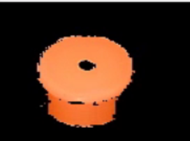
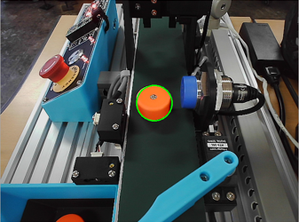
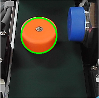
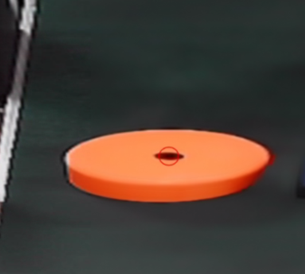

# 분류 알고리즘 및 데이터 처리 

## 색상 분류 
XConvey의 카메라를 통해 가공 작업이 완료된 이후 물체의 색상을 분류해보도록 하겠습니다. 색상 범위는 실습 환경의 밝기에 따라 달라질 수 있으며, 환경에 따른 색상 범위의 조정은 필요합니다. 

다음은 지정된 색상을 감지하는 코드입니다. 

```python
import cv2
import numpy as np

cam = cv2.VideoCapture(0)

try:
    while True:
        ret, img = cam.read()
        image = img[51:371,195:515]
        image = image[105:215,90:230]
        hsv = cv2.cvtColor(image, cv2.COLOR_BGR2HSV)

        lower_orange = np.array([10, 100, 100])  
        upper_orange = np.array([25, 255, 255]) 

        mask = cv2.inRange(hsv, lower_orange, upper_orange)
        orange_result = cv2.bitwise_and(image, image, mask=mask)

        cv2.imshow('Orange', orange_result)
        cv2.waitKey(30)
except KeyboardInterrupt:
    pass
finally:
    cv2.destroyAllWindows()
```



## 원 모형 분류 
XConvey에서 컨베이어를 통해 운반되고 가공되는 물체는 원기둥 형태입니다. 이 원기둥 형태의 가공 물체는 카메라가 인지하는 방향에 따라 다양한 형태의 모양으로 인지될 수 있습니다. 카메라로 부터 수신된 프레임의 색상을 그레이스케일링으로 변환합니다. 변환된 이미지를 HoughCircles()를 활용하여 원형의 외곽선을 감지하여 이미지 내부에 원형 모양의 도형을 추출합니다. 

```python
import cv2
import numpy as np

cap = cv2.VideoCapture(0)

def findCircle(img):
    gray = cv2.cvtColor(img, cv2.COLOR_BGR2GRAY)
    blurred = cv2.blur(gray, (3, 3))
    detected_circles = cv2.HoughCircles(blurred,cv2.HOUGH_GRADIENT,1,50,param1=50,param2=35, minRadius=35,maxRadius=50)
    if detected_circles is not None:
        detected_circles = np.uint16(np.around(detected_circles))
        for pt in detected_circles[0,:]:
            x, y, r = pt[0], pt[1], pt[2]
        return x,y,r
    else:
        return None,None,None

while True:
    ret, img = cap.read()
    resized_img = cv2.resize(img, (640,480))
    x, y, r = findCircle(resized_img)
    if x is not None and y is not None and r is not None:
        cv2.circle(resized_img, (x, y), r, (0, 255, 0), 2)
    cv2.imshow('frame', resized_img)
    if cv2.waitKey(1) == 27:
        break

cv2.destroyAllWindows()
```

HoughCircles()는 흑백으로 이루어진 이미지를 활용하여 원 모양을 감지하는 메소드입니다. 내부에는 캐니 엣지 감지를 통해 감지를 진행하며 감지된 원의 최소/최대 반지름을 통해 모든 원을 추출하는것이 아닌 정해진 크기의 원을 감지합니다. 



조금 더 나은 원 감지방법에는 여러가지가 있지만 가장 쉽게는 ROI를 지정하는 방식이 있습니다. 카메라를 통해 수신된 프레임은 컨베이어 벨트외에도 다른 여러 부분이 담겨 있으며 여기에는 직선, 사각형 등 여러 형태의 모양이 탐지될 수 있습니다. ROI 를 지정하여 컨베이어 벨트 위의 프레임에서만 감지를 하게하고, 감지된 최소 원의 반지름을 명확하게 지정한다면 컨베이어를 통해 운반되는 가공 물체만 정확히 추출할 수 있습니다. 또한 전체 이미지를 통해 탐지를 진행하지 않고 일부분을 활용하기 때문에 처리 속도 향상도 기대됩니다. 

```python
import cv2
import numpy as np

cap = cv2.VideoCapture(0)

def findCircle(img):
    gray = cv2.cvtColor(img, cv2.COLOR_BGR2GRAY)
    blurred = cv2.blur(gray, (3, 3))
    detected_circles = cv2.HoughCircles(blurred,cv2.HOUGH_GRADIENT,1,50,param1=50,param2=35, minRadius=35,maxRadius=50)
    if detected_circles is not None:
        detected_circles = np.uint16(np.around(detected_circles))
        for pt in detected_circles[0,:]:
            x, y, r = pt[0], pt[1], pt[2]
        return x,y,r
    else:
        return None,None,None

x1 = 250
x2 = 450 
y1 = 150
y2 = 350

while True:
    ret, img = cap.read()
    roi_img = img[y1:y2,x1:x2]
    x, y, r = findCircle(roi_img)
    if x is not None and y is not None and r is not None:
        cv2.circle(roi_img, (x, y), r, (0, 255, 0), 2)
    cv2.imshow('frame', roi_img)
    if cv2.waitKey(1) == 27:
        break

cv2.destroyAllWindows()
```



## 물체 가공 결과 추출 
OpenCV 의 SimpleBlobDetector는 이미지 내에서 "blob"이라 불리는 단순 형태의 물체(점 또는 덩어리)를 검출하는데 사용되는 메소드 입니다. Blob은 일반적인 이미지에서는 서로 연결된 픽셀들의 덩어리로, 주변과 비교했을때 색이나 밝기가 뚜렷하게 다른 영역을 지칭합니다. 

SimpleBlobDetector는 다음 조건에 따라 Blob을 탐지합니다.

- 크기 
- 원형도 
- 볼록도 
- 모양의 일관성 
- 밝기 

이제 SimpleBlobDetector를 이용해서 가공 물체 위에 찍힌 점을 감지하는 코드를 작성해 보겠습니다. 

```python 
import numpy as np
import cv2

try:
    cam = cv2.VideoCapture(0)
    params = cv2.SimpleBlobDetector_Params()
    detector = cv2.SimpleBlobDetector_create(params)
    while True:
        ret, img = cam.read()
        
        h,w = img.shape[:2]

        s_p = np.float32([[279,69],[399,69],[249,374],[467,374]])
        d_p = np.float32([[0,0],[w-1,0],[0,h-1],[w-1,h-1]])
        mat = cv2.getPerspectiveTransform(s_p, d_p)
        perspective = cv2.warpPerspective(img, mat, (w,h))

        dst = cv2.cvtColor(perspective, cv2.COLOR_BGR2HSV)
        dst1 = cv2.cvtColor(cv2.inRange(dst, (92,34,129), (141,202,255)), cv2.COLOR_GRAY2BGR)
        result = cv2.subtract(perspective, dst1)
        result = cv2.GaussianBlur(result, (0,0), 1)
        keypoints = detector.detect(result)

        im_with_keypoints = cv2.drawKeypoints(result, keypoints, np.array([]), (0,0,255), cv2.DRAW_MATCHES_FLAGS_DRAW_RICH_KEYPOINTS)

        cv2.imshow("detect", im_with_keypoints)
        if cv2.waitKey(1) == 27:
            break
except KeyboardInterrupt:
    pass
finally:
    cv2.destroyAllWindows()
``` 

