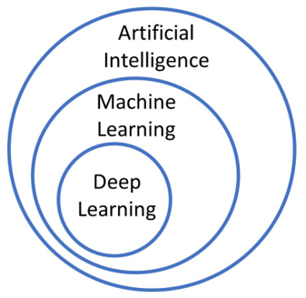
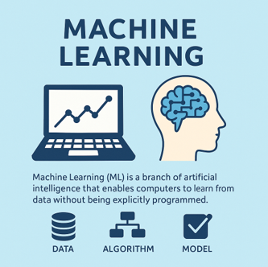
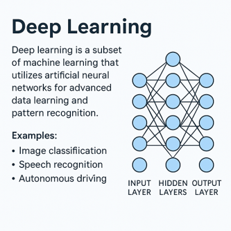

# 머신러닝(Machine Learning)
Machine Learning은 인공지능의 한 분야로, 컴퓨터가 명시적으로 프로그램되지 않고 데이터를 통해 스스로 학습하게 하는 기술입니다.
즉, 사람이 일일이 규칙을 코딩하지 않고, 알고리즘이 데이터를 분석하여 패턴을 인식하고, 그에 따라 예측 또는 판단을 하도록 훈련됩니다.

전통적인 프로그래밍 방식과 달리, 머신러닝은 컴퓨터가 명령어가 아닌 데이터로부터 학습하며, 반복적인 경험을 통해 성능이 향상됩니다.
이러한 접근은 특히 대용량 데이터를 다루는 현대의 문제 해결에 매우 효과적입니다.

딥러닝은 머신러닝의 하위 분야로, 인공신경망(Artificial Neural Network)을 기반으로 복잡한 데이터 구조를 분석하고 학습합니다.
심층 신경망 구조를 통해 이미지 인식, 음성 분석, 자연어 처리 등 고차원적인 문제 해결이 가능해졌습니다.



## AI (Artificial Intelligence)
인공지능(AI)은 컴퓨터가 인간처럼 사고하고, 학습하며, 판단하고 행동하도록 만드는 기술입니다.
AI는 ‘지능’이라는 개념을 모방하여 문제 해결, 추론, 계획 수립, 자연어 이해 등 다양한 지적 작업을 수행할 수 있도록 설계되었습니다.
초기에는 명시적인 규칙을 기반으로 작동하는 전문가 시스템이 주류였으나, 현재는 데이터를 바탕으로 스스로 학습하는 머신러닝 기반 기술로 중심이 옮겨지고 있습니다.
AI는 체스 두기, 언어 번역, 자율주행, 챗봇, 로봇 제어 등 매우 다양한 분야에서 활용되고 있습니다.


## ML (Machine Learning)
머신러닝(Machine Learning)은 인공지능의 하위 분야로, 컴퓨터가 명시적인 규칙 없이 데이터를 통해 스스로 패턴을 학습하고 예측하거나 분류하는 모델을 생성하는 기술입니다.
사람이 일일이 프로그램하지 않아도, 알고리즘이 데이터에 기반한 규칙을 스스로 찾아내기 때문에 자동화된 의사결정이나 예측이 가능해집니다.
머신러닝에는 지도학습, 비지도학습, 강화학습 등의 방법론이 있으며, 각기 다른 문제 유형에 따라 다양한 알고리즘(의사결정트리, SVM, KNN 등)이 사용됩니다.



## 딥러닝 (Deep Learning)
딥러닝(Deep Learning)은 머신러닝의 세분화된 영역으로, 인간의 뇌 구조를 본뜬 인공신경망(Neural Network)을 기반으로 작동하는 기술입니다.
여러 층(Layer)으로 구성된 신경망을 통해 복잡하고 고차원적인 데이터로부터 특징을 자동으로 추출하고, 이를 바탕으로 학습 및 예측을 수행합니다.
특히 이미지 인식, 음성 분석, 자연어 처리(NLP) 등에서 뛰어난 성능을 보이며, 대용량 데이터와 고성능 하드웨어의 발전과 함께 빠르게 확산되고 있습니다.
대표적인 딥러닝 모델로는 CNN, RNN, Transformer 등이 있으며, 오늘날의 챗봇이나 자율주행 알고리즘, 얼굴 인식 시스템 등에 활용됩니다.



## SpeechRecognition
음성 인식(STT, Speech To Text) 기술은 대표적인 인공지능 서비스 중 하나로, 스마트폰, 스피커, 내비게이션 등 다양한 기기에서 기본 기능으로 탑재되고 있습니다. 사용자는 음성으로 명령을 내리거나, 대화 내용을 자동으로 텍스트로 변환하는 기능을 자연스럽게 활용하고 있습니다.

여러 STT 도구 중 하나인 Python 기반의 SpeechRecognition 패키지를 사용해보겠습니다. 이 라이브러리는 마이크 입력이나 오디오 파일을 활용해 음성 데이터를 확보하고, 이를 다양한 음성 인식 API(Google, Sphinx 등)를 통해 텍스트로 변환할 수 있도록 지원합니다.

SpeechRecognition은 무료로 사용할 수 있지만, 일부 API(Google 등)는 일일/월간 사용량에 제한이 있을 수 있으므로 유의해야 합니다.

먼저 필요한 패키지 설치는 pip 명령을 통해 진행합니다. 

```sh 
pip install PyAudio==0.2.11
pip install SpeechRecognition==3.9.0
```

### 음성 인식 
아주 간단하게 SpeechRecognition 을 활용하는 예시입니다. 마이크를 통해 입력한 소리를 문자로 출력해주는 코드입니다. 

```python
import speech_recognition as sr

recognizer = sr.Recognizer()

with sr.Microphone() as source:
    print("Please speech...")
    audio = recognizer.listen(source)

try:
    print("Recognized text: " + recognizer.recognize_google(audio, language='en-US'))
except sr.UnknownValueError:
    print("Google Web Speech API can't understand your speech")
except sr.RequestError as e:
    print(f"Google Web Speech API has something error : {e}")
```

### 음성 인식 결과에서 키워드 추출하기 
음성을 통해 인식된 문자에서 특정 단어를 추출하도록 구성하면 다음과 같이 구성할 수 있습니다. 

```python
import speech_recognition as sr

def text_parsing(text):
    text = text.strip()
    if 'supply' in text:
        return 'supply'
    elif 'load' in text:
        return 'load'
    else:
        return None

recognizer = sr.Recognizer()

with sr.Microphone() as source:
    print("Please speech...")
    audio = recognizer.listen(source)

try:
    text = recognizer.recognize_google(audio, language='en-US')
    print("Recognized text : " + text)
    print("Parsing text : " + str(text_parsing(text)))
except sr.UnknownValueError:
    print("Google Web Speech API can't understand your speech")
except sr.RequestError as e:
    print(f"Google Web Speech API has something error : {e}")
```

## 음성을 통한 원격 제어 
음성 명령을 통해 XConvey의 Feeding 블록의 Servo 모터를 제어해보는 코드입니다. supply와 load 키워드를 활용하고 있지만 원하는 키워드가 있다면 변경하여 실행해보기 바랍니다. 

```python
from xconvey import Feeding
import speech_recognition as sr

feeding = Feeding()

def servo_control(text):
    text = text.strip()
    if 'supply' in text:
        feeding.supply()
    elif 'load' in text:
        feeding.load()
    else:
        return None

recognizer = sr.Recognizer()

while True:
    with sr.Microphone() as source:
        print("Please speech...")
        audio = recognizer.listen(source)

    try:
        text = recognizer.recognize_google(audio, language='en-US')
        print("Recognized text : " + text)
        servo_control(text)
    except sr.UnknownValueError:
        print("Google Web Speech API can't understand your speech")
    except sr.RequestError as e:
        print(f"Google Web Speech API has something error : {e}")
```

## CLIP 
CLIP(Contrastive Language–Image Pre-training)은 OpenAI 에서 제작한 모델로 사전 정의된 텍스트 라벨과 유사도를 비교하여 가장 적합한 설명을 출력하는 모델입니다. 

이미지와 텍스트를 동일한 임베딩 공간에 매핑하여, 이미지와 설명 문장이 얼마나 잘 맞는지를 비교하는게 핵심입니다. 

CLIP은 사전 정의된 클래스를 몰라도 텍스트 설명만으로 분류가 가능하며, 이미지와 텍스트를 동시에 입력받아 의미적 유사도를 정량화합니다. 그리고 학습데이터 없이도 제로샷(Zero-Shot) 이미지 분류가 가능합니다. 

CLIP에 대한 논문의 다음 링크에서 확인할 수 있습니다. 

- [CLIP Thesis](https://arxiv.org/abs/2103.00020)

이번장에서 필요한 패키지를 설치해보도록 하겠습니다. transformers 와 torch 모듈을 pip 명령을 통해 설치합니다. 

```sh
pip install transformers torch torchvision
```

## CLIP을 활용한 가공 물체 분류 

```python
import cv2
import torch
from PIL import Image
from transformers import CLIPProcessor, CLIPModel

model = CLIPModel.from_pretrained("openai/clip-vit-base-patch32")
processor = CLIPProcessor.from_pretrained("openai/clip-vit-base-patch32")

labels = [
    "an orange disc with a black ring in the center",
    "an orange disc with no mark",
    "a blue disc",
]

device = "cuda" if torch.cuda.is_available() else "cpu"
model = model.to(device)

cap = cv2.VideoCapture(0)

while True:
    ret, frame = cap.read()
    if not ret:
        break

    h, w, _ = frame.shape
    cx, cy = w // 4, h // 4
    roi_size = min(w, h) // 6
    cropped = frame[cy - roi_size//4: cy + roi_size//4, cx - roi_size//4: cx + roi_size//4]

    pil_image = Image.fromarray(cv2.cvtColor(cropped, cv2.COLOR_BGR2RGB))
    inputs = processor(text=labels, images=pil_image, return_tensors="pt", padding=True).to(device)
    outputs = model(**inputs)
    probs = outputs.logits_per_image.softmax(dim=1)[0]
    pred_label = labels[probs.argmax().item()]
    
    cv2.putText(frame, f'Pred: {pred_label}', (30, 30), cv2.FONT_HERSHEY_SIMPLEX, 0.7, (0,255,0), 2)
    cv2.imshow("CLIP Classification", frame)
    if cv2.waitKey(1) & 0xFF == ord('q'):
        break

cap.release()
cv2.destroyAllWindows()
```


