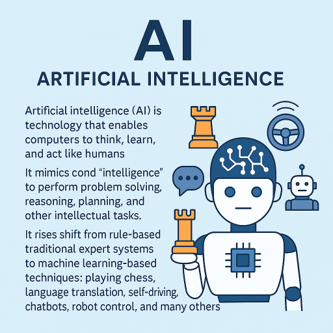

# 머신러닝(Machine Learning)
Machine Learning은 인공지능의 한 분야로, 컴퓨터가 명시적으로 프로그램되지 않고 데이터를 통해 스스로 학습하게 하는 기술입니다.
즉, 사람이 일일이 규칙을 코딩하지 않고, 알고리즘이 데이터를 분석하여 패턴을 인식하고, 그에 따라 예측 또는 판단을 하도록 훈련됩니다.

전통적인 프로그래밍 방식과 달리, 머신러닝은 컴퓨터가 명령어가 아닌 데이터로부터 학습하며, 반복적인 경험을 통해 성능이 향상됩니다.
이러한 접근은 특히 대용량 데이터를 다루는 현대의 문제 해결에 매우 효과적입니다.

딥러닝은 머신러닝의 하위 분야로, 인공신경망(Artificial Neural Network)을 기반으로 복잡한 데이터 구조를 분석하고 학습합니다.
심층 신경망 구조를 통해 이미지 인식, 음성 분석, 자연어 처리 등 고차원적인 문제 해결이 가능해졌습니다.


## AI (Artificial Intelligence)
인공지능(AI)은 컴퓨터가 인간처럼 사고하고, 학습하며, 판단하고 행동하도록 만드는 기술입니다.
AI는 ‘지능’이라는 개념을 모방하여 문제 해결, 추론, 계획 수립, 자연어 이해 등 다양한 지적 작업을 수행할 수 있도록 설계되었습니다.
초기에는 명시적인 규칙을 기반으로 작동하는 전문가 시스템이 주류였으나, 현재는 데이터를 바탕으로 스스로 학습하는 머신러닝 기반 기술로 중심이 옮겨지고 있습니다.
AI는 체스 두기, 언어 번역, 자율주행, 챗봇, 로봇 제어 등 매우 다양한 분야에서 활용되고 있습니다.



## ML (Machine Learning)
머신러닝(Machine Learning)은 인공지능의 하위 분야로, 컴퓨터가 명시적인 규칙 없이 데이터를 통해 스스로 패턴을 학습하고 예측하거나 분류하는 모델을 생성하는 기술입니다.
사람이 일일이 프로그램하지 않아도, 알고리즘이 데이터에 기반한 규칙을 스스로 찾아내기 때문에 자동화된 의사결정이나 예측이 가능해집니다.
머신러닝에는 지도학습, 비지도학습, 강화학습 등의 방법론이 있으며, 각기 다른 문제 유형에 따라 다양한 알고리즘(의사결정트리, SVM, KNN 등)이 사용됩니다.


## 딥러닝 (Deep Learning)
딥러닝(Deep Learning)은 머신러닝의 세분화된 영역으로, 인간의 뇌 구조를 본뜬 인공신경망(Neural Network)을 기반으로 작동하는 기술입니다.
여러 층(Layer)으로 구성된 신경망을 통해 복잡하고 고차원적인 데이터로부터 특징을 자동으로 추출하고, 이를 바탕으로 학습 및 예측을 수행합니다.
특히 이미지 인식, 음성 분석, 자연어 처리(NLP) 등에서 뛰어난 성능을 보이며, 대용량 데이터와 고성능 하드웨어의 발전과 함께 빠르게 확산되고 있습니다.
대표적인 딥러닝 모델로는 CNN, RNN, Transformer 등이 있으며, 오늘날의 챗봇이나 자율주행 알고리즘, 얼굴 인식 시스템 등에 활용됩니다.


## SpeechRecognition
음성 인식(STT, Speech To Text) 기술은 대표적인 인공지능 서비스 중 하나로, 스마트폰, 스피커, 내비게이션 등 다양한 기기에서 기본 기능으로 탑재되고 있습니다. 사용자는 음성으로 명령을 내리거나, 대화 내용을 자동으로 텍스트로 변환하는 기능을 자연스럽게 활용하고 있습니다.

여러 STT 도구 중 하나인 Python 기반의 SpeechRecognition 패키지를 사용해보겠습니다. 이 라이브러리는 마이크 입력이나 오디오 파일을 활용해 음성 데이터를 확보하고, 이를 다양한 음성 인식 API(Google, Sphinx 등)를 통해 텍스트로 변환할 수 있도록 지원합니다.

SpeechRecognition은 무료로 사용할 수 있지만, 일부 API(Google 등)는 일일/월간 사용량에 제한이 있을 수 있으므로 유의해야 합니다.

먼저 필요한 패키지 설치는 pip 명령을 통해 진행합니다. 

```sh 
pip install PyAudio==0.2.11
pip install SpeechRecognition==3.9.0
```

### 음성 인식 
아주 간단하게 SpeechRecognition 을 활용하는 예시입니다. 마이크를 통해 입력한 소리를 문자로 출력해주는 코드입니다. 

```python
import speech_recognition as sr

recognizer = sr.Recognizer()

with sr.Microphone() as source:
    print("Please speech...")
    audio = recognizer.listen(source)

try:
    print("Recognized text: " + recognizer.recognize_google(audio, language='en-US'))
except sr.UnknownValueError:
    print("Google Web Speech API can't understand your speech")
except sr.RequestError as e:
    print(f"Google Web Speech API has something error : {e}")
```

### 음성 인식 결과에서 키워드 추출하기 
음성을 통해 인식된 문자에서 특정 단어를 추출하도록 구성하면 다음과 같이 구성할 수 있습니다. 

```python
import speech_recognition as sr

def text_parsing(text):
    text = text.strip().lower()
    if 'supply' in text:
        return 'supply'
    elif 'load' in text:
        return 'load'
    else:
        return None

recognizer = sr.Recognizer()

with sr.Microphone() as source:
    print("Please speech...")
    audio = recognizer.listen(source)

try:
    text = recognizer.recognize_google(audio, language='en-US')
    print("Recognized text : " + text)
    print("Parsing text : " + str(text_parsing(text)))
except sr.UnknownValueError:
    print("Google Web Speech API can't understand your speech")
except sr.RequestError as e:
    print(f"Google Web Speech API has something error : {e}")
```

## 음성을 통한 원격 제어 
음성 명령을 통해 XConvey의 Feeding 블록의 Servo 모터를 제어해보는 코드입니다. supply와 load 키워드를 활용하고 있지만 원하는 키워드가 있다면 변경하여 실행해보기 바랍니다. 

```python
from xconvey import Feeding
import speech_recognition as sr

feeding = Feeding()

def servo_control(text):
    text = text.strip().lower()
    if 'supply' in text:
        feeding.supply()
    elif 'load' in text:
        feeding.load()
    else:
        return None

recognizer = sr.Recognizer()

while True:
    with sr.Microphone() as source:
        print("Please speech...")
        audio = recognizer.listen(source)

    try:
        text = recognizer.recognize_google(audio, language='en-US')
        print("Recognized text : " + text)
        servo_control(text)
    except sr.UnknownValueError:
        print("Google Web Speech API can't understand your speech")
    except sr.RequestError as e:
        print(f"Google Web Speech API has something error : {e}")
```

## PyTorch 
PyTorch는 Pythonic한 문법과 직관적인 설계로 유명한 오픈소스 딥러닝 프레임워크로, Facebook AI Research에서 개발했습니다. 동적 계산 그래프 (Dynamic Computational Graph) 를 사용하여, 실행 시점에 그래프가 생성되어 디버깅과 실험이 매우 유연하고 직관적입니다.Tensor 연산은 NumPy와 매우 유사하며, GPU 가속도 CUDA를 통해 자연스럽게 통합되어 대규모 연산도 효율적으로 처리할 수 있습니다.

TensorFlow는 정적 그래프 기반으로 최적화와 배포에 강점을 가지며, Keras는 고수준 API 중심이라 간편하지만 PyTorch만큼 유연하지 않습니다. PyTorch는 모델 학습, 추론, 커스터마이징, 연구용 프로토타이핑까지 하나의 코드 흐름에서 모두 다루기 쉬운 구조를 가지고 있어, 최근에는 연구자뿐만 아니라 산업계에서도 많이 채택되고 있으며, TorchScript와 ONNX 등으로 모델 배포까지 확장성이 강화되고 있습니다.


PyTorch 는 pip 명령을 통해 설치할 수 있습니다. 

```sh 
pip install pytorch 
```

PyTorch 의 API 문서는 다음 링크에서 확인할 수 있습니다. 

- [PyTorch API Documents](https://docs.pytorch.org/docs/stable/index.html)

## PyTorch 기반 색상 분류 모델 
PyTorch를 활용하여 XConvey 에서 컨베이어 벨트를 통해 운반되는 물체의 색상을 감지하는 모델을 제작해보도록 하겠습니다. 

### 색상 데이터셋 생성 
물체의 데이터셋은 XConvey의 카메라를 통해 촬영하여 편집하거나, 스마트폰으로 촬영하여 편집하는등의 작업을 통해 데이터셋을 수집할 수 있습니다. 여기서는 OpenCV를 통해 임의의 데이터셋을 제작하는 방법을 활용하겠습니다. 

XConvey에서 운반되는 물체의 색상은 초록색과 주황색입니다. 초록색과 주황색은 RGB 값으로 명확히 구분되지만, 조명, 각도, 카메라 설정 등에 따라 색상의 편차가 발생할 수 있습니다. 임의의 데이터셋을 생성할때 이러한 부분들을 고려하여 난수를 통해 주황색으로 혹은 초록색으로 감지할 수 있는 범위를 지정하여 랜덤하게 데이터셋이 생성되도록 합니다. 색상의 범위가 좁은경우에 카메라 각도에 따라, 주변 밝기에 따라 제작된 모델이 탐지한 결과에 영향을 미칠수 있기 때문에 몇번의 테스트를 통해 적절한 색상의 범위를 지정하는것이 중요합니다. 생성되는 이미지의 크기는 100x100 입니다. 

본 예제에서는 각 클래스당 500장을 생성하며, 두 가지 색상만 분류하므로 대용량의 학습 데이터는 필요하지 않습니다. 

```python
import cv2
import numpy as np
import os
from tqdm import tqdm

os.makedirs("data/green", exist_ok=True)
os.makedirs("data/orange", exist_ok=True)

def draw_circle(color_bgr, filename):
    img = np.ones((100, 100, 3), dtype=np.uint8) * 255 
    center = (50, 50)
    radius = 30
    cv2.circle(img, center, radius, color_bgr, -1)
    cv2.imwrite(filename, img)

for i in tqdm(range(500)):
    green_color = (0, np.random.randint(200, 256), 0)
    draw_circle(green_color, f"data/green/green_{i:03d}.png")
    orange_color = (0, np.random.randint(100, 160), np.random.randint(200, 256))
    draw_circle(orange_color, f"data/orange/orange_{i:03d}.png")
```

### 색상 분류 모델 학습 
데이터셋을 학습하여 모델을 생성해 보도록하겠습니다. 이미지 기반의 처리를 위해 CNN을 활용하여 2개의 클래스중 하나로 분류되도록 학습합니다. 모델 구조는 2개의 합성곱 + 풀링 레이어와 2개의 완전 연결층으로 구성된 아주 단순한 CNN입니다. 출력층에서는 2개의 클래스에 대한 raw score를 반환하며, 손실함수로 CrossEntropyLoss를 사용하여 Softmax와 Negative Log Likelihood를 자동으로 처리합니다. 

```python
import torch
import torch.nn as nn
import torch.optim as optim
from torchvision import datasets, transforms
from torch.utils.data import DataLoader

class ColorClassifier(nn.Module):
    def __init__(self):
        super(ColorClassifier, self).__init__()
        self.conv1 = nn.Conv2d(3, 16, 3)
        self.pool = nn.MaxPool2d(2, 2)
        self.conv2 = nn.Conv2d(16, 32, 3)
        self.fc1 = nn.Linear(32 * 23 * 23, 64)
        self.fc2 = nn.Linear(64, 2)  

    def forward(self, x):
        x = self.pool(F.relu(self.conv1(x)))   
        x = self.pool(F.relu(self.conv2(x)))   
        x = x.view(-1, 32 * 23 * 23)
        x = F.relu(self.fc1(x))
        x = self.fc2(x)
        return x

transform = transforms.Compose([transforms.ToTensor()])

train_data = datasets.ImageFolder("data", transform=transform)
train_loader = DataLoader(train_data, batch_size=32, shuffle=True)

model = ColorClassifier()
criterion = nn.CrossEntropyLoss()
optimizer = optim.Adam(model.parameters(), lr=0.001)

EPOCHS = 10
for epoch in range(EPOCHS):
    running_loss = 0.0
    for imgs, labels in train_loader:
        optimizer.zero_grad()
        outputs = model(imgs)
        loss = criterion(outputs, labels)
        loss.backward()
        optimizer.step()
        running_loss += loss.item()
    print(f"Epoch {epoch+1}/{EPOCHS}, Loss: {running_loss:.4f}")

torch.save(model.state_dict(), "color_model.pt")
print("Save Model: color_model.pt")
```

학습은 총 10회(epoch) 진행되며, 각 epoch마다 누적 손실값(loss)이 출력됩니다. 손실 값이 점차 감소하는지 확인하면서 학습을 이어갈지 판단해야 하며, 너무 빨리 감소가 멈추거나 진동하는 경우는 학습률, 배치 크기, 모델 구조 등을 조정해볼 수 있습니다.

보통 이진 분류 문제에서 초기 손실은 1.0~1.5 수준에서 시작하며, 학습이 잘 진행되면 0.1 이하 또는 0.05 이하까지 떨어질 수 있습니다. 만약 손실이 0.3 근처에서 더 이상 감소하지 않거나, 에폭이 반복되어도 계속 진동한다면, 모델이 데이터에 제대로 적응하지 못하고 있을 수 있습니다.

> 학습 성능을 더 정확하게 판단하려면 손실값 외에도 정확도(accuracy) 나 혼동 행렬(confusion matrix) 도 함께 확인하는 것이 좋습니다.
> 특히 손실이 낮더라도 한쪽 클래스만 예측하는 현상이 있을 수 있으므로, 단순히 loss 값만으로 과대평가하지 않도록 주의해야 합니다.

학습이 완료되면 모델은 "color_model.pt" 파일로 저장되며, 추후 추론 과정에서 불러와 사용할 수 있습니다.

### 색상 분류 모델 동작
이제 생성된 모델을 활용하여 XConvey의 카메라에서 수신한 프레임을 ROI 지정하여 100x100 크기로 인식할 부분을 전처리하고 모델에 입력하여 결과를 확인해 보겠습니다. 

모델을 통해 분류된 결과는 Green 또는 Orange 로 화면에 실시간으로 표시되도록 작성된 코드입니다. 

```python
import cv2
import numpy as np
import torch
import torch.nn as nn
import torch.nn.functional as F
from torchvision import transforms

class ColorClassifier(nn.Module):
    def __init__(self):
        super(ColorClassifier, self).__init__()
        self.conv1 = nn.Conv2d(3, 16, 3)
        self.pool = nn.MaxPool2d(2, 2)
        self.conv2 = nn.Conv2d(16, 32, 3)
        self.fc1 = nn.Linear(32 * 23 * 23, 64)
        self.fc2 = nn.Linear(64, 2)  

    def forward(self, x):
        x = self.pool(F.relu(self.conv1(x)))   
        x = self.pool(F.relu(self.conv2(x)))   
        x = x.view(-1, 32 * 23 * 23)
        x = F.relu(self.fc1(x))
        x = self.fc2(x)
        return x

model = ColorClassifier()
model.load_state_dict(torch.load("color_model.pt", map_location='cpu'))
model.eval()

preprocess = transforms.Compose([transforms.ToTensor(),])

cap = cv2.VideoCapture(0)
if not cap.isOpened():
    print("Cannot Open Camera")
    exit(1)

while True:
    ret, frame = cap.read()
    if not ret:
        continue

    h, w, _ = frame.shape
    cx, cy = w // 2, h // 2
    roi_size = 100
    roi = frame[cy - roi_size//2:cy + roi_size//2, cx - roi_size//2:cx + roi_size//2]
    rgb = cv2.cvtColor(roi, cv2.COLOR_BGR2RGB)
    input_tensor = preprocess(rgb).unsqueeze(0)

    with torch.no_grad():
        output = model(input_tensor)
        pred = torch.argmax(output, dim=1).item()

    label = "Green" if pred == 0 else "Orange"
    color = (0, 255, 0) if pred == 0 else (0, 128, 255)

    cv2.rectangle(frame, (cx - 50, cy - 50), (cx + 50, cy + 50), color, 2)
    cv2.putText(frame, f"Detected: {label}", (10, 30), cv2.FONT_HERSHEY_SIMPLEX, 1.0, color, 2)
    cv2.imshow("Live Color Classification", frame)
    if cv2.waitKey(1) & 0xFF == 27:
        break

cap.release()
cv2.destroyAllWindows()
```

### 색상 분류 모델 결과에 따른 가공 물체 분류 

```python
```
