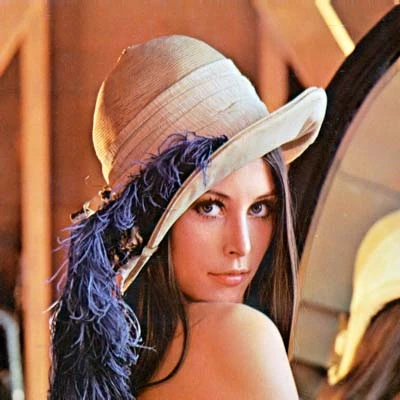
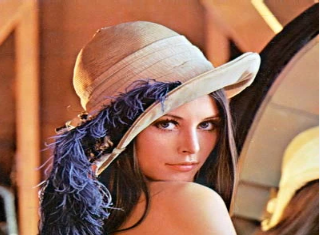
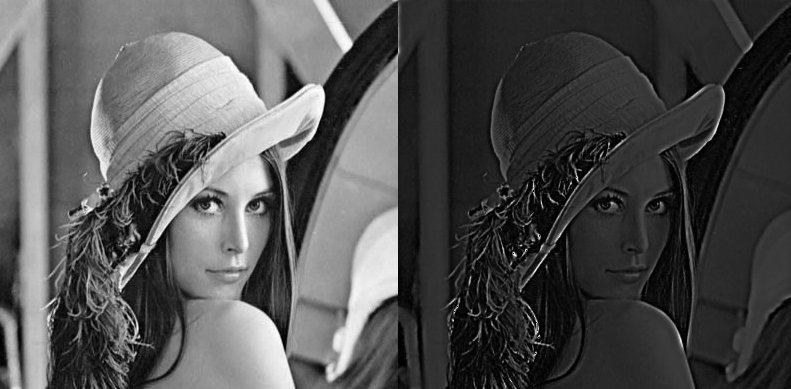
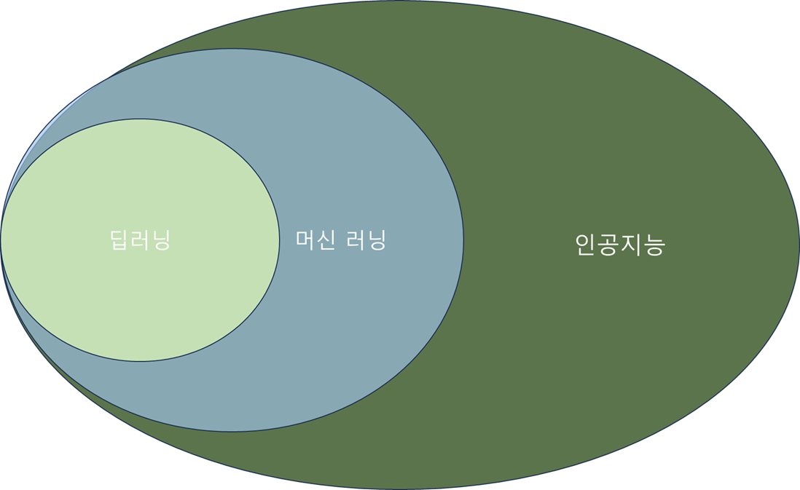
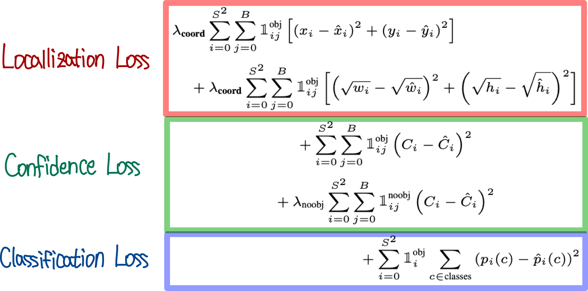

# [Vision 처리](<4. 비전처리.md>)
컴퓨터 비전은 인간의 시각 능력을 모방하고 이해하도록 컴퓨터의 로직을 구성하는 것이며, 인공지능의 한 분야로 발전하였습니다. 물론 인공지능 이전에도 영상을 처리하는 분야는 있었지만 인공지능 기술의 발달에 따라, 이전에는 불가능 했던 복잡한 로직의 구현이 가능해졌습니다. 비전 처리는 알고리즘을 구현한 프레임워크와 머신러닝과 딥러닝을 기반으로 하는 모델을 사용하여 디지털 이미지와 비디오를 해석할 수 있으며, 컴퓨터가 객체를 식별하고, 패턴, 나아가서 행동등을 구별할 수 있습니다.
본 장에서는 컴퓨터를 이용한 이미지 처리의 기본적인 도구인 OpenCV와 전처리, 머신러닝과 분류 알고리즘, 머신 러닝기반 분류의 확장을 학습합니다. 


&nbsp;


### OPENCV (Open Source Computer Vision Library)
컴퓨터 비전, 이미지프로세싱 머신러닝의 전반에 사용되는 영상처리 라이브러리 입니다
이미지와 비디오파일 혹은 디지털 데이타의 속성을 조절하는 도구 이며, 얼굴인식, 물체인식 그리고 로보틱스등에서 사용되고 있습니다.

OpenCV에서 사용되는 기능들에는 다음이 있습니다.
-  이미지 및 비디오 프로세싱: OpenCV는 이들의 조작과 분석 그리고 데이터변환등의 기능을 수행하며 컬러변환, edge detection, noise reduction 등의 기능을 제공합니다.
- Computer Vision: Object Detection, face recognition, feature extraction등의 기능을 제공하며, 자율주행차 surveillance system, 증강현실, 이미지 및 비디오 편집등에 사용되고 있습니다.
- 머신러닝과의 결합: 다양한 머신러닝 프레임워크의 학습과 학습데이더등의 작성에 사용되며, 분류 및 물체인식 비디오 분석등의 분야에서 견고한 도구로 사용되고 있습니다.
- 실시간 Performance: OpenCV는 실시간 처리를 위해 디자인 되어있습니다.
소프트웨어 엔지니어로 하여금 문제를 빨리 효율적으로 해결하도록 돕습니다.
- 오픈소스, 크로스 플랫폼: 소스가 오픈되어있으며, 다양한 개발 언어, 다양한 운영체제, 다양한 하드웨어 플랫폼을 지원합니다.

- OpenCV의 예제를 통해 사용방법을 익힙니다.
본 키트의 물체에 점을 찍는 공정을 거친 물체와 일반 물체를 OpenCV를 통해 분류하는 예제입니다.

&nbsp;

```python
import cv2
import numpy as np


cap = cv2.VideoCapture(1)


def hasPointInROI(frame):
    
    imgray = cv2.cvtColor(frame,cv2.COLOR_BGR2GRAY)
    ret,thresh = cv2.threshold(imgray, 100, 255,cv2.THRESH_BINARY)
    cimg = cv2.cvtColor(thresh,cv2.COLOR_GRAY2BGR)

    contours,hierarchy = cv2.findContours(thresh,2,1)
    cnt = contours

    for i in range (len(cnt)):
        #발견된 contour에서 원에 가까운 물체를 찾는다. 단 반지름의 길이를 제한한다. 
        (x,y),radius = cv2.minEnclosingCircle(cnt[i])
        center = (int(x),int(y))
        radius = int(radius)
        if(radius < 10 and radius >3 ):
            cv2.circle(frame,center,radius,(0,255,0),2)
        cv2.imshow("check", frame)


def findCircleInROI(img):
    frame = img.copy()
    gray = cv2.cvtColor(img, cv2.COLOR_BGR2GRAY)
    gray_blurred = cv2.blur(gray, (3, 3))
    detected_circles = cv2.HoughCircles(gray_blurred,cv2.HOUGH_GRADIENT,1,50,param1=50,param2=35, minRadius=35,maxRadius=50)

    # 발견된 원을 그린다.
    if detected_circles is not None:

        detected_circles = np.uint16(np.around(detected_circles))

        for pt in detected_circles[0, :]:
            a, b, r = pt[0], pt[1], pt[2]
            cv2.circle(frame, (a, b), r, (0, 255, 0), 2)
            cv2.imshow("Detected Circle", frame)
            cv2.waitKey(1)
            return a,b,r

    return None,None,None


while True:
    
    # Read image.
    _Result, img = cap.read()
    if(_Result != True):

        break

    org = img.copy()
    

    resized = cv2.resize(org, (640,480))
    x, y, r = findCircleInROI(resized)
    if(x is not None and y is not None and r is not None):

        crop_img = org[y-r:y+r, x-r:x+r]
        if(len(crop_img)!=0):
            hasPointInROI(crop_img)
 
    else:
        cv2.waitKey(1)

cv2.destroyAllWindows()
```


### 이미지 전처리

전처리 과정이란 컴퓨터 비전이나 머신러닝 알고리즘을 사용하기 위해 이미지나 동영상을 분석하거나 준비하는 과정입니다. 이미지 품질을 향상시키거나 관계성 있는 정보를 획득하고, 다른 연산처리에 사용되도록 최적화 되는 과정입니다.

이미지 전처리의 예는는 다음과 같습니다.
- 이미지 품질을 향상: 이미지 크기를 변경시키고, 노이즈를 제거하거나, 반사광을 줄이고, 변형을 시키거나 회복시키고, 명암을 조절할 수 있습니다.
- 이미지 표준화: 이미지 사이즈의 통일, 해상도 컬러스페이스의 조절
- Feature Extraction : 연관있는 이미지의 정보들을 분석할 수 있습니다.
- 모델 학습 : 머신러닝학습에 필요한 형태로 이미지를 준비할 수 있습니다. 


#### 예제 코드

1. 이미지 크기 조절

<원본>



``` python

import cv2

img = cv2.imread("lena.png")
resized = cv2.resize(img, (320,240))
cv2.imshow("resized", resized)
cv2.wait(0)

cv2.destroyAllWindows()
```
<크기변환>



2. 반사광 조절

```python


import cv2
import numpy as np

class HomomorphicFilter:

    def __init__(self, a = 0.5, b = 1.5):
        self.a = float(a)
        self.b = float(b)

    # Filters
    def __butterworth_filter(self, I_shape, filter_params):
        P = I_shape[0]/2
        Q = I_shape[1]/2
        U, V = np.meshgrid(range(I_shape[0]), range(I_shape[1]), sparse=False, indexing='ij')
        Duv = (((U-P)**2+(V-Q)**2)).astype(float)
        H = 1/(1+(Duv/filter_params[0]**2)**filter_params[1])
        return (1 - H)

    def __gaussian_filter(self, I_shape, filter_params):
        P = I_shape[0]/2
        Q = I_shape[1]/2
        H = np.zeros(I_shape)
        U, V = np.meshgrid(range(I_shape[0]), range(I_shape[1]), sparse=False, indexing='ij')
        Duv = (((U-P)**2+(V-Q)**2)).astype(float)
        H = np.exp((-Duv/(2*(filter_params[0])**2)))
        return (1 - H)

    # Methods
    def __apply_filter(self, I, H):
        H = np.fft.fftshift(H)
        I_filtered = (self.a + self.b*H)*I
        return I_filtered

    def filter(self, I, filter_params, filter='butterworth', H = None):
        
        if len(I.shape) is not 2:
            raise Exception('Improper image')
        
        I_log = np.log1p(np.array(I, dtype="float"))
        I_fft = np.fft.fft2(I_log)

        # Filters
        if filter=='butterworth':
            H = self.__butterworth_filter(I_shape = I_fft.shape, filter_params = filter_params)
        elif filter=='gaussian':
            H = self.__gaussian_filter(I_shape = I_fft.shape, filter_params = filter_params)
        elif filter=='external':
            print('external')
            if len(H.shape) is not 2:
                raise Exception('Invalid external filter')
        else:
            raise Exception('Selected filter not implemented')
        
        # Apply filter on frequency domain then take the image back to spatial domain
        I_fft_filt = self.__apply_filter(I = I_fft, H = H)
        I_filt = np.fft.ifft2(I_fft_filt)
        I = np.exp(np.real(I_filt))-1
        return np.uint8(I)

output_images = []

imgColor = cv2.imread("lena.png")
gray = cv2.cvtColor(imgColor, cv2.COLOR_BGR2GRAY)
homo_filter = HomomorphicFilter(a = 0.75, b = 1.25)
img_filtered = homo_filter.filter(I=gray, filter_params=[30,2])

output_images.append(gray)
output_images.append(img_filtered)
concat_image = np.hstack((output_images))
cv2.imshow("homo", concat_image)
cv2.waitKey(0)
cv2.destroyAllWindows()

```
<반사광 조절>



&nbsp;

*[연습문제]: 레나의 얼굴부분만을 확대한 이미지를 생성해봅니다.


## [머신러닝]()

&nbsp;



&nbsp;


Machine Learning(ML) 이란 인공지능의 한 분야로서 컴퓨터가 명시적으로 프로그램되지 하지 않고 학습하게 하는 것입니다. 데이터를 분석하는 알고리즘, 예측이나 결정을 하며, 보다 많은 알고리즘에 노출될 수록 일을 더 잘할 수 있게 됩니다.
기존의 프로그래밍과 다르게 컴퓨터는 명령을 받지 않고 데이터로부터 학습되도록 합니다.  딥러닝은 머신러닝의 한 분야로 인공신경망을 사용하는 인공지능이며, 복잡한 feature들과 pattern을 data로부터 얻고 여러 층의 레이어를 구성하여 이들간의 복잡한 데이터 패턴을 학습합니다.

### YOLO
YOLO 알고리즘은  이미지에서 ROI(Region of Interest) 를 설정하고 그 구간의 이미지데이터를 이용해 물체를 분류해내는 기술입니다.
보통의 이미지에는 여러 ROI 대상이 있으며, 이는 이미지 분류에 지장을 초래합니다.
Joseph Redmon 에 의해 2016에 창안되었고, 계속 발전해왔습니다.
YOLO(You Only Look Once)는 경계 상자와 클래스 확률을 모두 동시에 예측하는 종단 간 신경망을 사용합니다. 
Faster RCNN과 같은 알고리즘은 Region Proposal Network를 사용하여 관심 있는 가능한 영역을 감지한 다음 해당 영역에 대해 개별적으로 인식을 수행하는 반면, 
YOLO는 단일 완전 연결 계층의 도움을 받아 모든 예측을 수행합니다. 
Object detection은 컴퓨터 비젼의 한 분야로 물체를 분간하고, 이를 이미지나 영상에 표시하는 기술입니다.
자율주행 자동차나 로보틱스에서 매우 중요한 기술입니다.
이 기술은 oneshot detector 혹은 two stage detector로 분류됩니다.
oneshot detector 객체 감지는 입력 이미지의 단일 패스를 사용하여 이미지 내 객체의 존재 및 위치를 예측합니다. 
이 방법은 단일 패스로 전체 이미지를 처리하므로 계산 효율성이 높습니다.
그러나 단일 샷 객체 감지는 일반적으로 다른 방법보다 정확도가 떨어지며 작은 객체를 감지하는 데 효과적이지 않습니다. 
이러한 알고리즘은 리소스가 제한된 환경에서 실시간으로 객체를 감지하는 데 사용될 수 있습니다.
YOLO는 완전한 합성곱 신경망(CNN)을 사용하여 이미지를 처리하는 oneshot detector입니다.
two stage detector는 입력 이미지를 두 번 통과시켜 객체의 존재와 위치를 예측합니다. 첫 번째 단계는 일련의 제안이나 잠재적인 객체 위치를 생성하는 데 사용되고, 
두 번째 단계는 이러한 제안을 세부화하고 최종 예측을 내리는 데 사용됩니다. 이 방법은 단일 샷 객체 감지보다 정확하지만 계산 비용이 더 많이 듭니다.
단일 샷과 이중 샷 객체 감지 중 선택은 애플리케이션의 특정 요구 사항과 제약에 따라 달라집니다.

YOLO MODEL의 처음 20개 합성곱 계층은 임시 평균 풀링과 완전 연결 계층을 추가하여 ImageNet을 사용하여 사전 학습되었습니다. 
그런 다음, 사전 훈련된 모델을 변환하여 감지를 수행합니다. 
YOLO의 최종 완전 연결 레이어는 클래스 확률과 바운딩 박스 좌표를 모두 예측합니다.
YOLO는 입력 이미지를 S × S 그리드로 나눕니다. 물체의 중심이 격자 셀에 떨어지면, 해당 격자 셀이 해당 물체를 감지합니다. 
각 그리드 셀은 B개의 경계 상자와 해당 상자에 대한 신뢰도 점수를 예측합니다. 이러한 신뢰도 점수는 모델이 상자에 객체가 들어 있다고 확신하는 정도와 예측된 상자가
얼마나 정확하다고 생각하는지를 나타냅니다. YOLO 모델에 사용되는 주요 기술 중 하나는 비최대 NMS(Non maximum suppression) 입니다. 
NMS는 객체 감지의 정확도와 효율성을 개선하는 데 사용되는 후처리 단계입니다. 객체 감지에서는 이미지 내의 단일 객체에 대해 여러 개의 경계 상자가 생성되는 것이 일반적입니다. 
이러한 경계 상자는 겹치거나 다른 위치에 있을 수 있지만 모두 동일한 객체를 나타냅니다. NMS는 중복되거나 잘못된 경계 상자를 식별하고 제거하고 이미지의 각 객체에 대해 단일 경계 상자를 출력하는 데 사용됩니다.
네트워크는 24개의 합성곱 계층과 그 뒤에 2개의 완전연결계층으로 구성되어 있습니다. 1 × 1 는 번갈아 가며
이전 계층의 특징 공간을 줄입니다. ImageNet 분류에 대한 합성 계층을 사전 학습합니다.
해상도를 절반으로 줄여서 작업(224×224 입력 이미지)을 한 다음, 감지를 위해 해상도를 두 배로 높입니다.
가장 중요한 손실함수 디자인은 다음과 같습니다.



b-box regression loss, confidence loss, classification loss
b-box regression loss는 모든 grid cell에서 예측한 B개의 바운딩 박스의 좌표 (x, y, width, height)와 GT(Ground Truth) box 좌표의 오차를 구하는 공식이며
confidence loss는 모든 grid cell에서 예측한 B개의 클래스에 속할 확률값과 GT 값의 오차를 구하는 공식이다.
classification loss는 cell 내에 클래스가 존재할 확률을 구하는 공식이다.
추론시에는 한개의 그리드 셀은 30개의 아웃풋 값을 갖고 있습니다.. [ x,y,w,h,p ... C1,C2...C20] 이를 p값(클래스 확률)에 confidence 값들을 곱해줍니다.  
여러개의 바운딩 박스가 만들어지면, NMS 알고리즘으로 바운드 박스 갯수를 줄입니다.


YOLO 의 논문은 아래 링크에서 확인할 수 있습니다.

&nbsp;

https://www.cv-foundation.org/openaccess/content_cvpr_2016/papers/Redmon_You_Only_Look_CVPR_2016_paper.pdf

본 키트의 물체에 점을 찍는 공정을 거친 물체와 일반 물체를 YOLOv8 을 통해 분류하는 예제입니다.
Dataset은 https://github.com/hanback-lab/XConvey/src/yolo_data 에서 다운받을 수 있습니다.
```python
# Train Script
import os
os.environ['KMP_DUPLICATE_LIB_OK']='True'
from multiprocessing import Process, freeze_support
from ultralytics import YOLO
import onnx
import locale
locale.getpreferredencoding = lambda: "UTF-8"


def train():
    model = YOLO('yolov8n.pt')
    results = model.train(data='datasets/data.yaml', epochs=120, imgsz=320)
    #자동으로 runs 폴더 밑에 weight 폴더가 생성되고 그 및에 학습된 파일이 생성된다.

if __name__ == '__main__':
    freeze_support()
    train()
``` 

```python
# Predict Script
import cv2
import matplotlib.pyplot as plt

def imread(path):
    return cv2.imread(path)

def imwrite(img, path):
    if cv2.imwrite(path, img):
        print('Image saved to "{}"'.format(path))
    else:
        print('Failed to save image to "{}"'.format(path))

def imshow(img, figsize=(10, 10), is_bgr=True):
    if is_bgr:
        img = cv2.cvtColor(img, cv2.COLOR_BGR2RGB)
    plt.figure(figsize=figsize)
    plt.imshow(img, cmap='gray')
    plt.show()

import ultralytics

ultralytics.checks()
from ultralytics import YOLO
model = YOLO('runs/detect/train/weights/best.pt')


cap = cv2.VideoCapture(0)
while (True):
    success,frame = cap.read()
    if not success:
        break
    frame = cv2.resize(frame,(0,0),fx=1.5,fy=1.5)
    result = model.predict(frame,verbose=False)
    result = result[0].plot()
    print("result", result)
    cv2.imshow('yolo',result)
    if cv2.waitKey(1)& 0xFF == 27:    
        break
        
cap.release()
cv2.destroyAllWindows()

```
