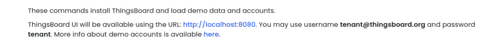
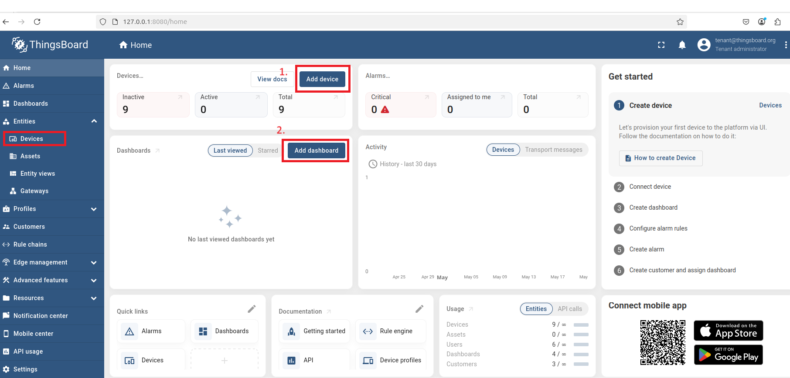
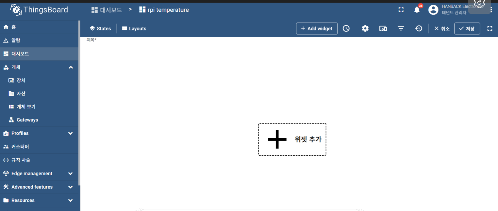
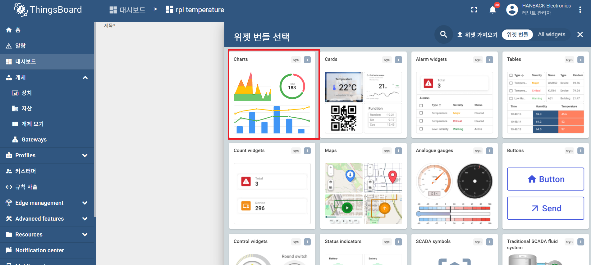
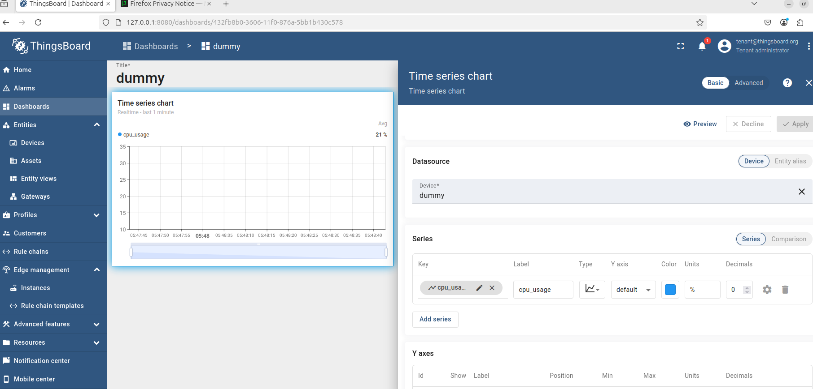

# [IOT 기기의 클라우드 연동](<5. 클라우드 대시보드 구축.md>)
IOT Device는 Light Weight Device로써 대부분 자체 데이터 모니터링 기능을 제공하지 않습니다. 또한 통신을 통해 많은 기기를 통합하여 유의미한 데이터를 생산하기도 합니다. 따라서 클라우드 서비스를 이용하여 다양한 IOT기기의 정보를 시각화하면, 사용자는 용이하게 데이터를 이해할 수 있게 됩니다.
본 장에서는 ThingsBoard를 이용하여 시각화를 구현해본다.


&nbsp;


### ThingsBoard
ThingsBoard는 센서데이터를 수집 시각화하는 IOT 플랫폼입니다. 디바이스 관리, 데이터 수집 및 시각화 경고 시스템, 원격 제어기능을 지원합니다. 사용자 맞춤 dashboard를 구성 할 수 있습니다.
SBC(Single Board Computer)에서 클라우드의 강력한 서버에 이르기까지 다양한 하드웨어 실행하고 활용되도록 설계되어 있습니다.

본 키트의 ThingsBoard는 Raspberry Pi에 설치 합니다.

### docker 설치
```out

sudo apt-get update
sudo apt-get install ca-certificates curl
sudo install -m 0755 -d /etc/apt/keyrings
sudo curl -fsSL https://download.docker.com/linux/ubuntu/gpg -o /etc/apt/keyrings/docker.asc
sudo chmod a+r /etc/apt/keyrings/docker.asc

# Add the repository to Apt sources:
echo \
  "deb [arch=$(dpkg --print-architecture) signed-by=/etc/apt/keyrings/docker.asc] https://download.docker.com/linux/ubuntu \
  $(. /etc/os-release && echo "${UBUNTU_CODENAME:-$VERSION_CODENAME}") stable" | \
  sudo tee /etc/apt/sources.list.d/docker.list > /dev/null
sudo apt-get update

sudo apt-get install docker-ce docker-ce-cli containerd.io docker-buildx-plugin docker-compose-plugin
sudo snap install docker
sudo apt install docker-compose

```
### 필요한 소프트웨어 설치
```out

sudo apt update
sudo apt upgrade -y
sudo apt-get update && sudo apt-get install openssh-server
sudo systemctl status ssh
sudo systemctl start ssh
sudo systemctl enable ssh
```

### 방화벽 설정
```out
sudo ufw allow ssh
sudo ufw enable
sudo ufw status
```
### 도커 및 도커 Compose 설치
```out
mkdir -p ~/thingsboard && cd ~/thingsboard
vi docker-compose.yml
```
#### docker-compose.yml 의 내용
```out
version: '3.3'

services:
  postgres:
    image: postgres:14
    container_name: postgres
    restart: always
    environment:
      POSTGRES_DB: thingsboard
      POSTGRES_USER: tb_user
      POSTGRES_PASSWORD: tb_password
    ports:
      - "5432:5432"
    volumes:
      - postgres-data:/var/lib/postgresql/data

  tb:
    image: thingsboard/tb-postgres
    container_name: thingsboard
    restart: always
    depends_on:
      - postgres
    ports:
      - "8080:9090"
      - "1883:1883"
      - "5683:5683/udp"
    environment:
      SPRING_DATASOURCE_URL: jdbc:postgresql://postgres:5432/thingsboard
      SPRING_DATASOURCE_USERNAME: tb_user
      SPRING_DATASOURCE_PASSWORD: tb_password
      TB_QUEUE_TYPE: in-memory
    volumes:
      - tb-data:/data
      - tb-logs:/var/log/thingsboard

volumes:
  postgres-data:
  tb-data:
  tb-logs:
```
### 방화벽에서 포트 열기
```out
sudo ufw allow 8080/tcp
sudo ufw allow 9090/tcp
sudo ufw allow 1883/tcp
sudo ufw allow 5432/tcp
sudo ufw allow 5683/udp
```
### Docker 권한 설정
```out
sudo usermod -aG docker soda
logout
```
### 컨테이너 실행
cd ~/thingsboard

sudo docker-compose up -d

### PostgreSQL 외부 접속 설정
```out
sudo docker exec -it -u 0 postgres bash
apt-get update && apt-get install nano -y
cd /var/lib/postgresql/data
nano pg_hba.conf
```
아래 라인 추가 및 저장 (Ctrl + X -> Y -> Enter)
```out
host    all all 0.0.0.0/0   md5
```
```out
exit
sudo docker restart postgres
```
### 접속 확인
브라우져에서 아래 주소로 접속합니다.
http://127.0.0.1:8080

- 기본 계정 : sysadmin@thingsboard.org
- 기본 비밀번호 : sysadmin


&nbsp;

```out
python3 -m pip config set global.break-system-packages true
pip3 install tb-mqtt-client

```

http://127.0.0.1:8080 로 방문해서 logout후 다음 그림과 같이 입력한다.





왼쪽의 메뉴에 device가 나타난다. 그림의 1번 버튼으로 디바이스를 추가한다 (이름 : dummy)





이제 왼쪽에 Entity 화면이 보인다. 자신의 raspberry pi 의 데이터를 보여줄 것이므로, dummy 로 device 를 생성한다.
user에서 tenant 를 찾은후 access token을 복사하여 예제코드의 ACCESS_TOKEN 을 업데이트 한다. THINGSBOARD_SERVER 또한 적당한 ip로 맞게 기입한다.

왼쪽 메뉴에서 그림의 (2)번 버튼으로 dashboard를 선택하여 추가한다.


Add Widget으로 Widget을 추가한후 좌상단의 그래프를 선택한후,


그래프에서 막대 그래프를 선택한다, X축 시간과, Y축 CPU Usage를 적용한다.




하기와 같이 MQTT Publishing Client를 작성한다.

```python
import logging.handlers
import time
import os
   
from tb_gateway_mqtt import TBDeviceMqttClient
   
ACCESS_TOKEN = "-------------------------------"
THINGSBOARD_SERVER = '127.0.0.1'

logging.basicConfig(level=logging.DEBUG)
   
client = None
   
# default blinking period
usage = 1.0

   
# callback function that will call when we will change value of our Shared Attribute
def attribute_callback(result, _):
     print(result)
     # make sure that you paste YOUR shared attribute name
     period = result.get('cpu_usage', 1.0)

# callback function that will call when we will send RPC
def rpc_callback(id, request_body):
    # request body contains method and other parameters
    print(request_body)
    method = request_body.get('method')
    if method == 'getTelemetry':
        attributes, telemetry = get_data()
        client.send_attributes(attributes)
        client.send_telemetry(telemetry)
    else:
        print('Unknown method: ' + method)
   
   
def get_data():
    cpu_usage = round(float(os.popen('''grep 'cpu ' /proc/stat | awk '{usage=($2+$4)*100/($2+$4+$5)} END {print usage }' ''').readline().replace('\n', '').replace(',', '.')), 2)
    ip_address = os.popen('''hostname -I''').readline().replace('\n', '').replace(',', '.')[:-1]
    mac_address = os.popen('''cat /sys/class/net/*/address''').readline().replace('\n', '').replace(',', '.')
    processes_count = os.popen('''ps -Al | grep -c bash''').readline().replace('\n', '').replace(',', '.')[:-1]
    swap_memory_usage = os.popen("free -m | grep Swap | awk '{print ($3/$2)*100}'").readline().replace('\n', '').replace(',', '.')[:-1]
    ram_usage = float(os.popen("free -m | grep Mem | awk '{print ($3/$2) * 100}'").readline().replace('\n', '').replace(',', '.')[:-1])
    st = os.statvfs('/')
    used = (st.f_blocks - st.f_bfree) * st.f_frsize
    boot_time = os.popen('uptime -p').read()[:-1]
    avg_load = (cpu_usage + ram_usage) / 2
   
    attributes = {
        'ip_address': ip_address,
        'macaddress': mac_address
    }
    telemetry = {
        'cpu_usage': cpu_usage,
        'processes_count': processes_count,
        'disk_usage': used,
        'RAM_usage': ram_usage,
        'swap_memory_usage': swap_memory_usage,
        'boot_time': boot_time,
        'avg_load': avg_load
    }
    print(attributes, telemetry)
    return attributes, telemetry
   
# request attribute callback
def sync_state(result, exception=None):
     global usage
     if exception is not None:
         print("Exception: " + str(exception))
     else:
         usage = result.get('shared', {'cpu_usage': 1.0})['cpu_usage']

def main():
     global client
     client = TBDeviceMqttClient(THINGSBOARD_SERVER, username=ACCESS_TOKEN)
     client.connect()
     client.request_attributes(shared_keys=['cpu_usage'], callback=sync_state)
        
     # now attribute_callback will process shared attribute request from server
     sub_id_1 = client.subscribe_to_attribute("cpu_usage", attribute_callback)
     sub_id_2 = client.subscribe_to_all_attributes(attribute_callback)

     # now rpc_callback will process rpc requests from server
     client.set_server_side_rpc_request_handler(rpc_callback)

     while not client.stopped:
         attributes, telemetry = get_data()
         client.send_attributes(attributes)
         client.send_telemetry(telemetry)
         time.sleep(60)
   
if __name__=='__main__':
    if ACCESS_TOKEN != "TEST_TOKEN":
        main()

```




그림처럼 cpu_usage 21% 의 데이터를 확인할 수 있다.


- 연습문제: swap_memory_usage 를 표시하는 widget 을 생성해본다.