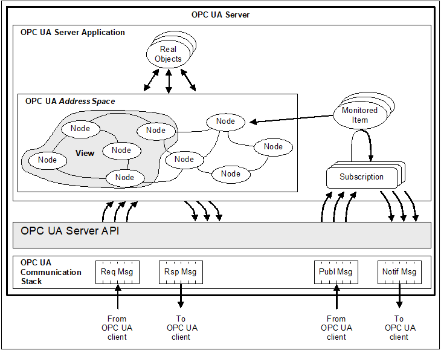

# OPC UA 
OPC UA (Open Platform Communications Unified Architecture)는 산업용 자동화 및 IoT 환경에서 센서, 제어기, PLC, SCADA 시스템 등의 데이터를 표준화하고 통신을 안정적으로 보장하기 위한 플랫폼 독립적이고 확장 가능한 통신 프로토콜입니다.


OPC UA 의 특징을 정리하면 다음과 같습니다. 

- 플랫폼 독립성 : Windows, Linux, Andorid 등 모든 플랫폼에서 동작 
- 보안 내장 : 인증, 암호화, 사용자 권한 등 내장 보안 기능 
- 모델링 기능 : 단순한 변수뿐만 아니라, 구조체, 이벤트 등 복잡한 정보 모델도 표현 가능 
- 서비스 기반 아키텍처 : 서버-클라이언트 구조, Pub/Sub 방식도 지원 

## 클래식 OPC 인터페이스 
클래식 OPC (OLE for Process Control)는 1996년경부터 산업용 자동화 장비와 소프트웨어 간의 데이터 통신을 위해 만들어졌으며, Microsoft의 COM/DCOM 기술을 기반으로 개발되었습니다. 따라서 클래식 OPC는 Windows 운영체제에 종속적이고, 방화벽이나 네트워크 분할 환경에서는 구성 및 보안에 어려움이 많았습니다.

주로 다음과 같은 세 가지 인터페이스를 중심으로 동작합니다.

- OPC DA (Data Access) : 가장 기본적인 인터페이스로, 센서나 제어기에서 실시간 값을 주고받을 때 사용합니다.
- OPC HDA (Historical Data Access) : 과거 데이터, 즉 기록된 이력 데이터를 읽어올 수 있도록 정의된 인터페이스입니다.
- OPC A&E (Alarms and Events) : 시스템 이벤트, 상태 변화, 경고 알림 등을 송수신하는 데 사용됩니다.

클래식 OPC는 당시 산업현장에서의 장비 통신 문제를 단순하고 효율적으로 해결해 주었지만, OS 종속성과 복잡한 구성, 보안 미지원 등의 한계가 존재했습니다. 이에 대한 해결책으로 OPC UA가 등장하게 된 것입니다.

## 클래식 OPC와 OPC UA 의 차이점 
클래식 OPC와 OPC UA는 기술적으로 많은 차이점을 가지고 있으며, 목적과 적용 환경에서도 큰 변화를 보여줍니다.

클래식 OPC는 Windows에서만 동작하며 COM/DCOM이라는 구식 기술 스택을 활용하기 때문에, 다른 운영체제나 클라우드 환경에서는 적용이 어렵고, 방화벽이 존재하는 분산 시스템에서는 포트 설정 문제나 보안 취약점이 빈번히 발생합니다.

반면, OPC UA는 TCP/IP 기반의 현대적인 프로토콜로 설계되었으며, 플랫폼 독립적인 아키텍처를 기반으로 Windows뿐 아니라 Linux, Android, iOS, 웹 브라우저 등에서도 동작할 수 있도록 설계되었습니다.

또한 OPC UA는 단순한 값 전달을 넘어서, 객체 모델 기반의 정보 표현을 지원하여 센서, 장비, 시스템 간의 데이터 모델링까지 가능하게 합니다. 이는 스마트팩토리나 IIoT(산업용 IoT) 환경에서 데이터를 단순히 수집하는 것 이상으로, 의미 있는 정보로 구성하여 상호운용성을 높이는 데 큰 역할을 합니다.

| 항목 | 클래식 OPC | OPC UA |
|------|------------|--------|
| 통신 방식 | COM/DCOM | TCP/IP, HTTPS, WebSocket |
| 운영체제 | Windows 전용 | Windows, Linux, Android 등 |
| 보안 | 제한적 | 암호화, 인증, 권한 제어 |
| 확장성 | 구조 제한적 | 서비스 구조 기반으로 확장 용이 |
| 데이터 모델 | 단순 변수 | 객체 지향 모델 |


## OPC UA 구조 
OPC UA는 단순한 데이터 전송 프로토콜이 아니라, 산업 시스템에서의 정보 표현 방식까지 통합적으로 정의한 정보 중심 아키텍처(Information-Centric Architecture)입니다. OPC UA의 구조는 크게 주소 공간(Address Space)을 이루는 Node 기반 구조와, 데이터 전송을 담당하는 서버-클라이언트 통신 구조로 나누어 볼 수 있습니다.



### Node 기반 구조
OPC UA에서 모든 데이터 요소는 Node라는 단위로 표현됩니다. 즉, 센서 하나, 변수 하나, 명령 하나도 모두 Node로 구성되며, 각각의 Node는 고유 ID와 속성, 참조 관계를 가집니다. 이를 통해 OPC UA는 단순 값(Value) 전달을 넘어서, 객체(Object)를 구성하고 계층적으로 표현하는 정보 모델링 능력을 갖추게 됩니다.

| Node 종류 | 설명 |
|-----------|------|
| Object | 현실 세계의 개체(ex : 온도센서, 모터 등) |
| Variable | 개체의 속성 값 (ex : 현재 온도, 전압 등) |
| Method | 개체가 실행할 수 있는 동작(ex : 초기화, 리셋) |
| Reference | 노드 간 연결을 정의 (부모-자식 관계 등) |
| DataType | 사용되는 데이터의 타입(ex : Float, String) |

다음은 Node 기반 구조의 예시입니다. 

```out
Objects (Root)
└── TemperatureSensor (Object Node)
├── Temperature (Variable Node, Float)
├── Humidity (Variable Node, Float)
└── ResetSensor() (Method Node)
```

이러한 구조 덕분에 OPC UA는 단순히 "센서 값을 가져온다" 수준을 넘어서, 센서의 상태, 기능, 설정값 등을 구조적으로 표현할 수 있게 되며, 이는 디지털 트윈, 스마트 팩토리 등의 구현에 필수적인 기능입니다.

### 통신 구조
OPC UA는 기본적으로 서버-클라이언트 모델로 동작합니다. 클라이언트는 OPC UA 서버에 접속하여 정보를 요청하거나 메서드를 실행하며, 서버는 이를 응답합니다. 또한, 최신 버전에서는 Pub/Sub 구조도 지원하여 MQTT나 UDP 기반 브로드캐스트 방식도 가능합니다.

- 서버(Server)
  - 데이터를 보유하고 주소 공간(Address Space)을 제공
  - 클라이언트 요청에 응답하며, 변수 값 변경, 메서드 호출 등을 처리

- 클라이언트(Client)
  - 서버에 접속하여 데이터를 읽거나 쓸 수 있음
  - 메서드 실행, 변수 구독(Subscription) 등을 통해 상호작용 가능

### 통신 흐름 예시 
1. 클라이언트가 서버에 접속 (`opc.tcp://ip:port`)
2. 서버의 루트 노드에서 시작해 주소 공간 탐색
3. 원하는 변수(Node)에 접근하여 값 읽기 또는 쓰기
4. 필요 시, Method를 호출하여 장비 동작 제어
5. Subscription으로 특정 변수의 값 변화 실시간 수신 가능

OPC UA의 통신은 기본적으로 TCP 기반이며, 메시지는 Binary Encoding 또는 XML로 전송됩니다.

```out
[Client]
├─> 서버 접속 (Session 생성)
├─> Node 탐색 (Browse)
├─> 변수 읽기/쓰기 (Read/Write)
├─> 메서드 호출 (Call)
└─> Subscription 등록 (Subscribe)
```

```out
[Server]
├─ Node ID, Type, Attribute, Reference 관리
├─ 데이터 값 유지 및 갱신
└─ 보안 정책, 인증, 세션 유지 관리
```

## OPC UA 서버/클라이언트 
OPC UA 는 파이썬 기반의 라이브러리를 제공하고 있으며 아래 명령을 통해 설치할 수 있습니다. 

```sh
pip install opcua
```

### OPC UA 서버 

```python
from opcua import Server
import time

server = Server()
server.set_endpoint("opc.tcp://0.0.0.0:4840/freeopcua/server/")

uri = "http://example.org"
idx = server.register_namespace(uri)

objects = server.get_objects_node()
temp_obj = objects.add_object(idx, "TemperatureSensor")
temp_var = temp_obj.add_variable(idx, "Temperature", 25.0)
temp_var.set_writable()

server.start()
print("OPC UA Server running...")

try:
    while True:
        val = temp_var.get_value()
        temp_var.set_value(val + 0.1)
        time.sleep(1)
except KeyboardInterrupt:
    print("Server Shutdown...")
finally:
    server.stop()
```

### OPC UA 클라이언트 

```python 
from opcua import Client

client = Client("opc.tcp://192.168.100.3:4840/freeopcua/server/")
client.connect()

uri = "http://example.org"
idx = client.get_namespace_index(uri)

objects = client.get_objects_node()
temp_obj = objects.get_child([f"{idx}:TemperatureSensor"])
temp_var = temp_obj.get_child([f"{idx}:Temperature"])

print("Current Temperature:", temp_var.get_value())
temp_var.set_value(30.0)
print("Temperature Value : 30")

client.disconnect()
```

## OPC UA 를 활용한 물체 이동 감지 

### 서버 

```python
from opcua import Server
from xconvey import Feeding, Processing, Sorting
import time

feeding = Feeding()
processing = Processing()
sorting = Sorting()

server = Server()
server.set_endpoint("opc.tcp://0.0.0.0:4840/freeopcua/server/")

uri = "http://example.org"
idx = server.register_namespace(uri)

objects = server.get_objects_node()
photo_obj = objects.add_object(idx, "PhotoSensor")
feeding_var = photo_obj.add_variable(idx, "Feeding", feeding.photo)
feeding_var.set_writable()
processing_var = photo_obj.add_variable(idx, "Processing", processing.photo)
processing_var.set_writable()
sorting_var = photo_obj.add_variable(idx, "Sorting", sorting.photo)
sorting_var.set_writable()

server.start()
print("OPC UA Server running...")

try:
    while True:
        feeding_var.set_value(feeding.photo)
        processing_var.set_value(processing.photo)
        sorting_var.set_value(sorting.photo)
        time.sleep(0.2)
except KeyboardInterrupt:
    print("Server Shutdown...")
finally:
    server.stop()
```

### 클라이언트

```python
from opcua import Client

client = Client("opc.tcp://192.168.100.3:4840/freeopcua/server/")
client.connect()

uri = "http://example.org"
idx = client.get_namespace_index(uri)

objects = client.get_objects_node()
photo_obj = objects.get_child([f"{idx}:PhotoSensor"])
feeding_var = photo_obj.get_child([f"{idx}:Feeding"])
processing_var = photo_obj.get_child([f"{idx}:Processing"])
sorting_var = photo_obj.get_child([f"{idx}:Sorting"])

print("Current Feeding state:", feeding_var.get_value())
print("Current Processing state:", processing_var.get_value())
print("Current Sorting state:", sorting_var.get_value())

client.disconnect()
```

<details>
<summary>OPC UA Pub/Sub 구조 예시</summary>

## Pub/Sub 구조 예시 
OPC UA의 통신을 Pub/Sub 형태로 구현해보겠습니다. 파이썬 기반 OPC UA 라이브러리를 사용하면 OPC UA의 최신 스펙을 기반으로 하지만, 완전한 Pub/Sub 구현을 제공하지는 않습니다. 대신 Suscription 기반의 구조로 유사한 형태로 구현을 할 수 있습니다. 

### OPC UA Pub 

```python
from opcua import Server
import time
import random

server = Server()
server.set_endpoint("opc.tcp://0.0.0.0:4840/pubsub/server/")
uri = "http://example.org"
idx = server.register_namespace(uri)

objects = server.get_objects_node()
sensor = objects.add_object(idx, "TemperatureSensor")
temperature = sensor.add_variable(idx, "Temperature", 25.0)
temperature.set_writable()

server.start()
print("OPC UA Pub Server running...")

try:
    while True:
        new_temp = round(random.uniform(20, 30), 2)
        temperature.set_value(new_temp)
        print(f"New Temperature : {new_temp}°C")
        time.sleep(2)
except KeyboardInterrupt:
    print("Sever Shutdown...")
finally:
    server.stop()

```

### OPC UA Sub 

```python
from opcua import Client, ua
from opcua.common.subscription import Subscription

class SubHandler:
    def datachange_notification(self, node, val, data):
        print(f"Recieved Temperature Value : {val}°C")

client = Client("opc.tcp://<SERVER_IP>:4840/pubsub/server/")
client.connect()
print("Server Connect!")

temp_node = client.get_objects_node().get_child(["0:TemperatureSensor", "0:Temperature"])

handler = SubHandler()
subscription = client.create_subscription(1000, handler)
handle = subscription.subscribe_data_change(temp_node)

try:
    while True:
        pass
except KeyboardInterrupt:
    print("Subscription End")
    subscription.unsubscribe(handle)
    subscription.delete()
    client.disconnect()

```

</details>